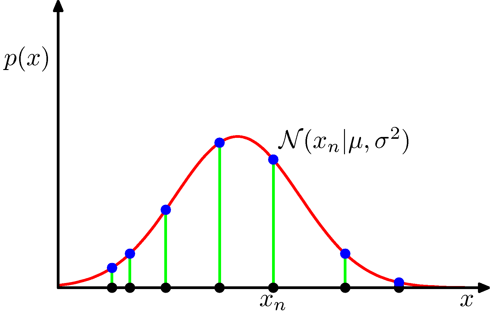

# PRML勉強会

1. [1.2.2 期待値と分散](#/1)
2. [1.2.3 ベイズ確率](#/2)
3. [1.2.4 ガウス分布](#/3)

---

## 1.2.2 期待値と分散

--

### 期待値

- $E[f] = \sum_x p(x) f(x)$

- $E[f] = \int p(x) f(x) dx$

- $E[f] \simeq \frac{1}{N} \sum_{n=1}^{N} f(x_n)$

  - 離散・連続を問わず有限の$N$点で近似可能
  - $N \rightarrow \infty$ の極限で厳密になる。
  - サンプリング（11章）などで用いる

--

#### 多変数の場合、平均を取る変数を指定する

$E_\color{red}{x}[f(\color{red}{x}, y)]$

この場合、 $x$ について周辺化されており、結果は $y$ についての関数になる。

--

### 条件付き期待値

- $E_x[f|y] = \sum_x p(x|y)f(x)$

  - 条件付き確率に事前条件が反映されるだけ

- 連続変数についても同様

--

### 分散

- $var[f] = E[(f(x) - E[f(x)])^2]$

  - $f(x)$ がその平均値 $E[f(x)]$ の周りでどれだけばらつくか、を表す

- $var(x) = E[(x - E[x])^2]$
  - 確率変数 $x$ についても分散を考えたもの
  - 恒等関数をとるのと同義

--

### 分散の公式

$var[f]$

$= E[(f(x) - E[f(x)])^2]$
$= E[f(x)^2 - 2 f(x) E[f(x)] + E[f(x)]^2]$
$= E[f(x)^2] - 2 E[f(x) E[f(x)]] + E[E[f(x)]^2]$
$= E[f(x)^2] - 2 E[f(x)] E[f(x)] + E[f(x)]^2 \cdots (\ast)$
$= E[f(x)^2] - E[f(x)]^2$

$\ast$ 期待値の期待値は期待値

--

### 共分散

$cov[x, y]$

$= E_{x, y}[\\{x-E[x]\\}\\{y-E[y]\\}]$
$= E_{x, y}[x y] - E[x]E[y]$

$x$ と $y$ が同時に変動する度合い

--

#### 独立であれば共分散は0

- 直感的には、
  - 独立 $\Leftrightarrow$ 『同時に変動する度合い』が0

- $E_{x, y}[x y] = E[x]E[y]$ を示せば良い
  - → 次ページ

--

#### 演習1.6

独立の定義 $p(x, y) = p(x) p(y)$ より

$E_{x, y}[x y]$

$= \int\int p(x, y) xy dx dy$

$= \int\int (p(x) x) (p(y) y) dx dy$

$= \int p(x) x dx \int p(y) y dy$

$= E[x]E[y]$

--

### 確率変数ベクトルの共分散

$cov[\mathbf{x}, \mathbf{y}]$

$= E_{\mathbf{x}, \mathbf{y}}[\\{\mathbf{x}-E[\mathbf{x}]\\}\\{\mathbf{y}-E[\mathbf{y}]\\}]$
$= E_{\mathbf{x}, \mathbf{y}}[\mathbf{x} \mathbf{y}^\mathrm{T}] - E[\mathbf{x}]E[\mathbf{y}^\mathrm{T}]$

- 確率変数ベクトル $\mathbf{x}$, $\mathbf{y}$ に関する共分散を表す行列

- ベクトル $\mathbf{x}$ の成分間の共分散は、 $cov[\mathbf{x}] \equiv cov[\mathbf{x}, \mathbf{x}]$
  - 分散共分散行列（対角成分には分散、非対角成分には共分散）

---

## 1.2.3 ベイズ確率

--

### ベイズ vs 頻度主義

- 頻度主義的・古典的確率
  - 確率は、ランダムな繰り返し試行の頻度
- ベイズ的確率
  - 確率は不確実性の度合い
  - 事前分布という信念を導入する
- どこまで主観性を認めるかが違い
- PRMLでは、有用な場面ではどちらも用いる（ベイズ多め）

--

### ベイズ確率を採用する根拠

- 確率の加法・乗法定理（ベイズの定理）が、信念の定量化・操作のための単純な公理集合から導かれる (Cox, 1946)
  - 確率論 $\equiv$ ブール論理を不確実性を含む場合に拡張したもの (Jaynes, 2003)
- その他にも多くの提案されている性質や公理が、確率の乗法・加法定理に従う

--

### ベイズ確率

$p(\mathbf{w}|D) = \frac{p(D|\mathbf{w}) p(\mathbf{w})}{p(D)}$

事後確率 $\propto$ 尤度 $(p(D|\mathbf{w})) \times$ 事前確率

- データを観測する前に$\mathbf{w}$に関する仮説を事前分布$p(\mathbf{w})$として表現できる
- $D$というデータを得た **事後** の、$\mathbf{w}$の不確実性を評価できる

--

### ベイズ確率

$p(D) = \int p(D|\mathbf{w}) p(\mathbf{w}) d\mathbf{w}$

- $尤度(p(D|\mathbf{w}))$は確率分布ではない（積分は1になるとは限らない）
- $p(D)$は、事後確率$p(\mathbf{w}|D)$を確率分布にするための定数
- 事後確率$p(\mathbf{w}|D)$、 尤度$p(D|\mathbf{w})$、事前確率$p(\mathbf{w})$はすべて$\mathbf{w}$の関数となっている

--

### 尤度関数

- ベイズ・頻度主義どちらでも重要となる
- ベイズでは
  - データ$D$のみがあり、 $\mathbf{w}$は確率分布
- 頻度主義では
  - $\mathbf{w}$は固定パラメータ、推定量として
  - データ$D$の分布を考慮して得る（最尤推定）

--

### 事前分布

- 頻度主義では、コイン投げで3回連続で表が出ると、表が出る確率は100％になる
- ベイズ確率で、事前分布を導入すれば、それほど極端な値にはならない
  - 逆に言えば、悪い事前分布を選べば高確率で悪い結果になる
    - この場合、頻度主義では、交差確認（1.3節）を使える

--

### ベイズの計算コスト

- モデル選択や予測に必要な **周辺尤度（エビデンス）** $p(D)$ の計算が重い
  - $p(D) = \sum_{\mathbf{w}} p(D|\mathbf{w}) p(\mathbf{w})$
  - 離散の場合は組み合わせ爆発
  - 連続の場合には積分が解析不可能
    - ガウス分布等であれば解析も可能
  - MCMC（サンプリング法, 11章）や計算機の発達により実用的に
  - 変分ベイズやEP法（期待値伝播法）等の決定論的近似法（10章）も寄与

---

## 1.2.4 ガウス分布

--

#### ガウス分布

$N(x | \mu, \sigma^2) = \frac{1}{(2\pi\sigma^2)^{1/2}}\exp\\{-\frac{1}{2\sigma^2} (x-\mu)^2\\}$

- $\beta = 1 / \sigma^2$ を精度パラメータという
- 確率密度である
  - $N(x | \mu, \sigma^2) > 0$
  - $\int N(x | \mu, \sigma^2) dx = 1$

--

#### ガウス分布

- 期待値・平均値 $\mu$
- 2次モーメント $E[x^2] = \int N(x | \mu, \sigma^2) x^2 dx = \mu^2 + \sigma^2$
- よって分散は $var[x] = E[x^2] - E[x]^2 = \sigma^2$
- 最頻値は平均値に一致

--

### 多変量正規分布

$N(\mathbf{x}|\mathbb{\mu}, \mathbb{\sum}) = \frac{1}{(2\pi)^{D/2}} \frac{1}{(|\mathbb{\sum}|)^{1/2}} \exp\\{-\frac{1}{2} (\mathbf{x}-\mathbf{\mu})^{\mathrm{T}} \mathbb{\sum}^{-1} (\mathbf{x}-\mathbf{\mu})\\}$

- 多変数にしたもの
- $\sum$は共分散
- $|\sum|$は共分散の行列式
- 詳細は2.3節

--

### ガウス分布のパラメータ推定

- N個のデータ点が同じガウス分布から独立に生成されるとする
- データ点が同じ分布から独立に生成されることを、 **独立同分布(i.i.d.)** という
  - independent identically distributed
- パラメータ$\mu, \sigma^2$を求めたい

--

### ガウス分布に対する尤度関数

$p(\mathbf{x}|\mu,\sigma^w) = \prod_{n=1}^N N(x_n|\mu, \sigma^2)$

- 独立な確率変数集合の同時分布なので、積をとればよい
- 与えられたデータの同時確率を最大化するパラメータを求めれば良い

--

### ガウス分布に対する尤度関数の図示

- イメージとしては、最大化することで、多くのデータが集まるところに最頻値を持ってこれる

--

### 尤度関数の最大化

$\ln p(\mathbf{x}|\mu, \sigma^2) = - \frac{1}{2\sigma^2} \sum_{n=1}^{N} (x_n - \mu)^2 - \frac{N}{2} \ln\sigma^2 - \frac{N}{2}\ln(2\pi)$

- $\mu$, $\sigma$に関して同時最大化
- 単調増加な対数をとる
  - 解析が容易になる
  - アンダーフロー防止（確率の積が和に変わる）
- 標本平均と標本分散を得る

--

### 尤度関数の最大化

- 最尤推定（Maximum Likelihood）の問題
  - 分散が過小評価される（バイアス）
  - $E[\sigma^2_{ML}] = \frac{N-1}{N} \sigma^2$
  - サンプル数が増えればバイアスも減る
  - 過学習に関連

--

### 分散の過小評価の直感的説明

- 各データ集合に2点のみ
- 平均の平均は真の平均に見えるが、
- 分散はどれも $\frac{1}{2}$ に過小評価されている

--

#### 分散の過小評価の証明

$E(\sigma^2_{ML})$

$= E(\frac{1}{N}\sum_{n=1}^N(x_n - \mu_{ML})^2)$
$= \frac{1}{N} E[\sum_{n=1}^N (x_n^2 - 2 x_n \mu_{ML} + \mu_{ML}^2)]$
$= \mu^2 + \sigma^2 - \frac{2}{N} E(\sum_{n=1}^N x_n \mu_{ML}) + E(\mu_{ML}^2)$
$= \mu^2 + \sigma^2 - \frac{2}{N^2} E[(\sum_{n=1}^N x_n)^2] + \frac{1}{N^2} E[(\sum_{n=1}^N x_n)^2]$
$= \mu^2 + \sigma^2 - \frac{1}{N^2} E[(\sum_{n=1}^N x_n)^2]$
$= \mu^2 + \sigma^2 - \frac{1}{N^2} [N(N\mu^2+\sigma^2)]$
$= \frac{N-1}{N} \sigma^2$

--

### 分散パラメータの不偏推定量

$E(\sigma^2_{ML}) = \frac{N-1}{N} \sigma^2$ より
$\tilde{\sigma}^2 = \frac{N-1}{N} \sigma_{ML}^2 = \frac{1}{N-1} \sum_{n=1}{N} (x_n - \mu_{ML}) ^ 2$ は分散パラメータの不偏推定量

10.1.3節で、この結果をベイズアプローチによって示す。

---

# お詫び

~~GSuite, PowerPoint, PDFの推奨を見逃しており、慣れてて楽だったのでこれで書きましたが、数式のレンダリングが重すぎたり、PDFにするときにバグがあったので、次回移行GSuiteに移行します。~~

スライド版の数式を事前にレンダリングする処理が実装できたのと、PDF化はMarkdownの時点で済ませればOKなので、しばらくはこちらで運用します。
