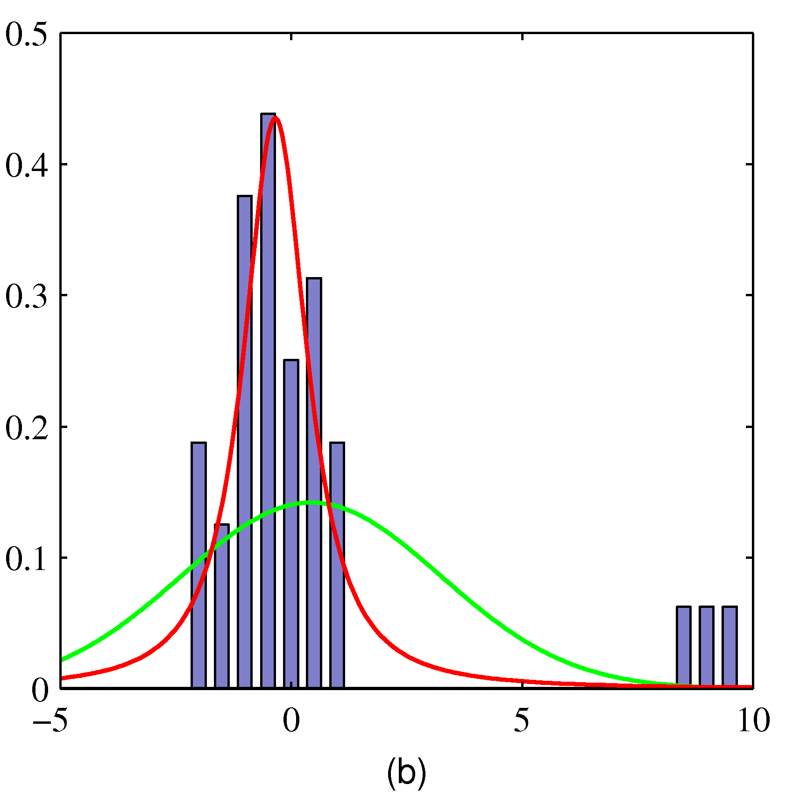
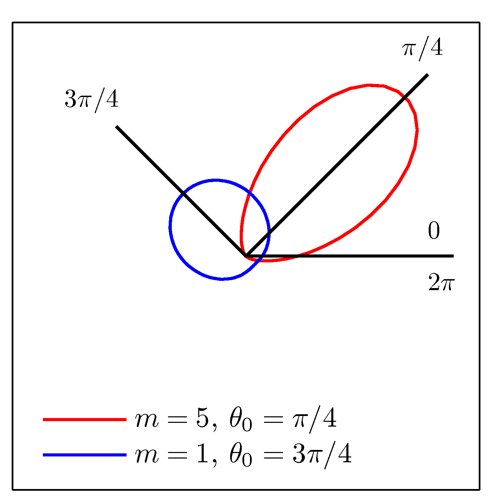

# PRML勉強会

1. [2.3.7 スチューデントのt分布](#/1)
2. [2.3.8 周期変数](#/2)

---

## 2.3.7 スチューデントのt分布

--

### 2.3.7 スチューデントのt分布

- ガウス分布に対して、ガンマ分布を 精度$\tau=\frac{1}{\sigma^2}$ の事前分布とし、精度を積分消去すると、スチューデントのt分布が得られる。

$p(x|\mu, a, b)$

$= \int_0^\infty \cal{N}(x|\mu, \tau^{-1}) \mathrm{Gam}(\tau | a, b) d\tau$

$= \frac{b^a}{\Gamma(a)} (\frac{1}{2\pi})^{1/2} [b+\frac{(x-\mu)^2}{2}]^{-a-1/2} \Gamma (a+1/2)$

--

### スチューデントのt分布

ガンマ分布のパラメータ $a, b$ を、$v=2a$, $\lambda =a/b$と変換すると、

$St(x | \mu, \lambda, v) = \frac{\Gamma(v/2+1/2)}{\Gamma(v/2)} (\frac{\lambda}{\pi v})^{1/2}[1+\frac{\lambda(x-\mu)^2}{v}]^{-v/2-1/2}$

という形で得られる。

--

### t分布の特徴

- 平均が同じで精度の異なる正規分布を無限個足し合わせたもの
- 元のガウス分布の分散にはよらない
- ガンマ分布の変数$a$と$b$からなる、自由度$v$と精度$\lambda$による

--

### コーシー分布

- 自由度$v$が1のときの分布をコーシー分布という
    - 極限値がとれないため期待値はない
    - 大数の法則・中心極限定理が成立しない

--

### t分布の特徴

<video autoplay controls width="70%" src="./images/t-dist.mp4"></video>

- $v\rightarrow\infty$ で $\cal N(x|\mu,\lambda^{-1})$

--

### t分布の頑健性

$\color{red}{赤}$がt分布、$\color{green}{緑}$が正規分布（1枚目は重なっている）

- 最尤推定解を比較すると（t分布については12章EMアルゴリズムで得る）
- 外れ値に影響されづらいことが分かる

--

### t分布の使われ方

- 頑健性
    - ラベル付けのミスのような異常値や、サンプルサイズが小さく外れ値があり、分散が定められない場合
    - 実際にすそが長い分布の場合に有効
- t検定
    - 母集団が正規分布に従うという仮定の下で、帰無仮説が成立するとき、t分布に従うことを用いるなど

--

### t分布の使われ方

- 回帰問題にも有効
    - 最小二乗法は誤差が正規分布を取るなどの仮定の下での最尤推定に相当し、頑健でない
    - t分布のような、すその重い分布を使えば、外れ値に強くできる

--

### 多変量スチューデントt分布

多変量ガウス分布 $\cal N(\mathbf{x}|\mu, \Lambda)$ に対応したものを考えて、同じく積分すると

$St(\mathbf{x} | \mu, \Lambda, v) = \frac{\Gamma(D/2+v/2)}{\Gamma(v/2)} \frac{|\Lambda|^{1/2}}{(\pi v)^{D/2}}[1+\frac{\Delta^2}{v}]^{-D/2-v/2}$

ただし、$D$は$\mathbf{x}$の次元数、$\Delta$はマハラノビス距離で、

$\Delta^2 = (\mathbf{x} - \mu)^\top \Lambda(\mathbf{x} - \mu)$

--

### 多変量スチューデントt分布の性質

1変数の場合と対応して、以下の性質を持つ

- $v>1$ のとき $\mathbb{E}[\mathbf{x}] = \mu$
- $v>2$ のとき $cov[\mathbf{x}] = \frac{v}{v-2}\Lambda^{-1}$
- $\mathrm{mode}[\mathbf{x}] = \mu$

---

## 2.3.8 周期変数

--

### 周期を持った量をモデル化したい

- 例： 日付や風向

--

### 周期を持った量をモデル化したい

- $\theta1 = 1^\circ$, $\theta2 = 359^\circ$ という例を考えてみる。
- 丸をデータ点として、原点の取り方を考える

--

### 周期を持った量をモデル化したい

- 原点を上の線（$0^\circ$）にとると、平均$180^\circ$, 標準偏差$179^\circ$
- 原点を下の線（$180^\circ$）にとると、平均$0^\circ$, 標準偏差$1^\circ$
- 恣意的な原点の決め方に、強く依存
    - 特別な方法が必要

--

### ベクトルの利用

- データ点を単位円上のベクトルとみなす

--

### ベクトルの利用

- 角度ではなく、ベクトルの平均を取る
    - 原点に依存しない

$\overline{\mathbf{x}} = \frac{1}{N}\displaystyle{\sum_{n=1}^{N}\mathbf{x}_n}$

<!-- $\overline{\mathbf{x}} = (\overline{x_1}, \overline{x_2})$ -->

$\overline{\theta} = tan^{-1}\{\frac{\sum_n sin\theta_n}{\sum_n cos\theta_n}\}$

--

### フォンミーゼス（循環正規）分布

- 満たすべき条件
    - $p(\theta) \geq 0$
    - $\int_0^{2\pi}p(\theta)d\theta = 1$
    - $p(\theta+2\pi)=p(\theta)$
        - $\forall M \in \mathbb{Z},  p(\theta+M2\pi)=p(\theta)$

--

### フォンミーゼス（循環正規）分布

- 先述の条件を満たすガウス分布を考えてみる
    - 2変数にする, $\mathbf{x} = (x_1, x_2)$
    - 平均は $\mu = (\mu_1, \mu_2)$
    - 共分散行列 $\Sigma = \sigma^2\mathbf{I}$

$p(x_1, x_2) = \frac{1}{2\pi\sigma^2} \exp\{-\frac{(x_1-\mu_1)^2 + (x_2-\mu_2)^2}{2\sigma^2}\}$

- ただし、正規化されていない。

--

### フォンミーゼス（循環正規）分布

$\color{red}{単位円}$で条件付けを行う($r=1$)

--

### フォンミーゼス（循環正規）分布

指数部分（$\exp$の中身）を以下のように変形できる

- 極座標に写して表現
- 展開
- $r=1$で条件付け
- 三角関数を用いる
- $\theta$に依存しない部分を$const$でくくる

$-\frac{1}{2\sigma^2} \{(cos\theta - r_0 cos\theta_0)^2 + (sin\theta - r_0 sin\theta_0)^2\}$

$= \frac{r_0}{\sigma^2} cos(\theta - \theta_0) + const$

--

### フォンミーゼス（循環正規）分布

- ここで、正規分布での逆分散・精度に類似する概念として、集中度パラメータ$m=r_0/\sigma^2$を導入して整理すると

$p(\theta|\theta_0, m) = \frac{1}{2\pi I_0(m)}\exp\{cos(\theta-\theta_0)\}m$

ただし、$I_0(m) = \frac{1}{2\pi} \int_0^{2\pi} \exp\{cos\theta m\}d\theta$

--

### フォンミーゼス（循環正規）分布

$p(\theta|\theta_0, m) = \frac{1}{2\pi I_0(m)}\exp\{cos(\theta-\theta_0)\}m$

- $\theta_0$ は分布の平均
- $I_0(m)$ は正規化係数で、0次の第1種変形ベッセル関数
- $m$が大きくなると、近似的にガウス分布となる
- 単峰性である
    - 多峰性を得るには、混合分布をつくる

--

### フォンミーゼス（循環正規）分布

- 左は直交座標、右は極座標

$p(\theta|\theta_0, m) = \frac{1}{2\pi I_0(m)}\exp\{cos(\theta-\theta_0)\}m$

<!-- --

$I_0(m) = \frac{1}{2\pi} \int_0^{2\pi} \exp\{cos\theta m\}d\theta$ -->

--

### 循環正規分布の最尤推定

$\ln p(D|\theta_0, m) =$

$-N\ln(2\pi) - N\ln I_0(m) + m\displaystyle{\sum_{n=1}^{N}}cos(\theta_n-\theta_0)$

上記の対数尤度関数に対して、$\theta_0$についての導関数を0とおくと、周期変数の導入時に得た観測値の平均 $\overline{\theta}$に一致する。

$\theta_0^{ML} = tan^{-1}\{\frac{\sum_n sin\theta_n}{\sum_n cos\theta_n}\}$

--

### 循環正規分布の最尤推定

- $I'_0(m)=I_1(m)$ (Abramowitz and Stegun, 1965)
- $\theta_0$を最尤推定解$\theta_0^{ML}$で置き換え
- $A(m)=\frac{I_1(m)}{I_0(m)}$として$m$についての導関数を0とし、

$A(m_{ML}) = \frac{1}{N}\displaystyle{\sum_{n=1}^{N}}cos(\theta_n-\theta_0^{ML})$

- 加法定理による変形で評価を容易にできる他、逆関数は数値的に求められる。

<!--  -->

--

### 周期変数の他の扱い方

- 極座標を一定幅に分割してヒストグラムで扱う
    - 単純で柔軟なものの
    - 2.5節で扱う問題もある
        - 非連続性
        - 次元の呪い（1.4節）
- ガウス分布の周辺化
    - 複雑
- 実数軸上の分布を周期変数に写像（巻き込む）
    - 複雑

---

## まとめ

- スチューデントのt分布の導入
    - 正規分布を重ね合わせた分布
    - 頑健性をもつ
- 周期変数の導入
    - 原点によらないモデル化が可能
    - PRMLでもあまり使わないらしい...
