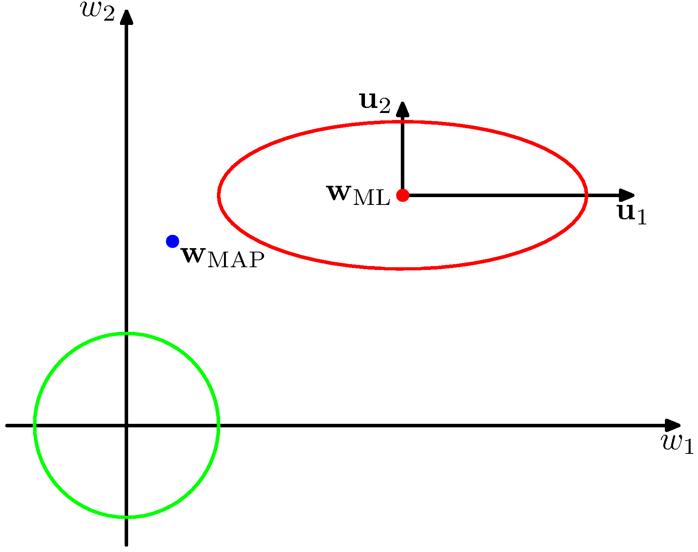
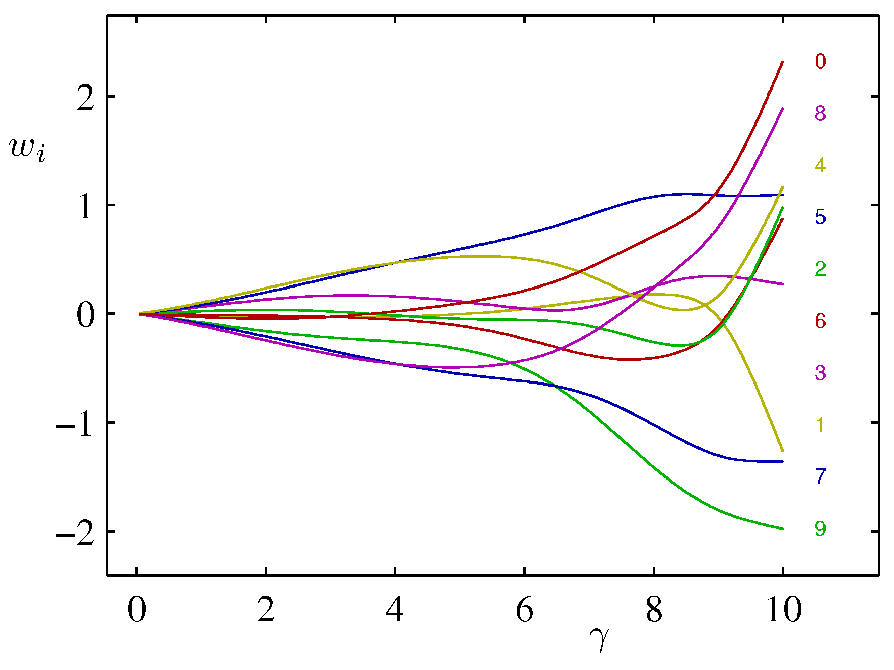
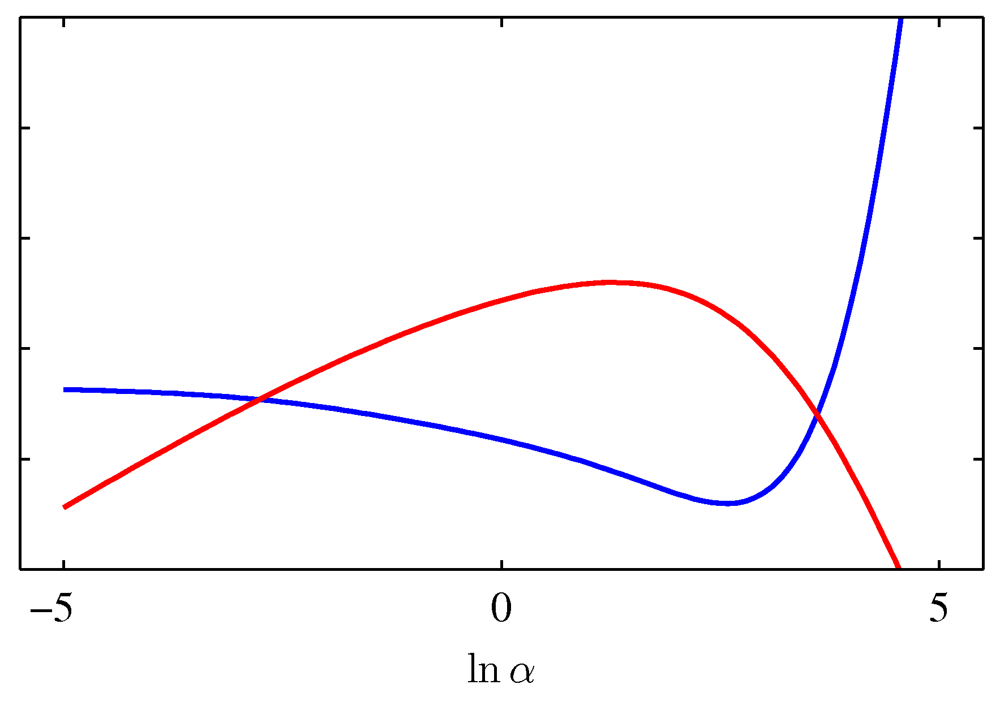

# PRML勉強会

1. [3.5.1 エビデンス関数の評価](#/1)
2. [3.5.2 エビデンス関数の最大化](#/2)
3. [3.5.3 有効パラメータ数](#/3)
4. [3.6 固定された基底関数の限界](#/4)

---

## 3.5.1 エビデンス関数の評価

--

### 復習

- 3.5では、対数エビデンスの最大化によって超パラメータ $\alpha, \beta$ を決める
- 3.5最後の対数エビデンスの最大化についての議論は次節
- まずは、最大化する対数エビデンス $p(\mathbf{t}|\alpha, \beta)$ の評価とモデル選択について

--

### パラメータのおさらい

- $\alpha$ は重みパラメータ $w$ の事前分布としたガウス分布の精度（分散の逆数）
- $\beta$ は観測値 $t$ にノイズとしたガウス分布の精度

--

### 周辺尤度

- $\alpha$ を決定 → 重みパラメータ $w$ の分布が分かる
- 重みパラメータ $w$ と $\beta$ が決定 → 予測結果の分布が分かる
- これらの同時分布を重みパラメータ $w$ について周辺化したものが周辺尤度

--

### 周辺尤度の評価

$p(\mathbf{t}|\alpha, \beta)$

$= \int p(\mathbf{t} | \mathbf{w}, \beta) p(\mathbf{w} | \alpha)d\mathbf{w}$

$= p( \mathbf{t} | \alpha, \beta ) = \left( \frac{\beta}{2 \pi} \right)^{N/2} \left( \frac{ \alpha }{ 2 \pi} \right)^{M/2} \int \exp \\{ -E(\mathbf{w}) \\} d\mathbf{w}$

ただし、

$E(\mathbf{w})$

$= \beta E_D(\mathbf{w}) + \alpha E_{\mathbf{w}} \mathbf{w}$

$= \frac{\beta}{2} \left\Vert \mathbf{t} - \Phi \mathbf{w} \right\Vert^2 + \frac{\alpha}{2} \mathbf{w}^T \mathbf{w}$

--

これを $\mathbf{w}$ で平方完成すると

$E(\mathbf{w}) = E(\mathbf{m_N}) + \frac{1}{2} (\mathbf{w} - \mathbf{m_N})^T A (\mathbf{w} - \mathbf{m_N})$

ただし、

$A = \alpha I + \beta \Phi^T \Phi$ で $\nabla\nabla E(\mathbf{w})$ に対応し、

$E(\mathbf{m_N}) = \frac{\beta}{2} \left\Vert \mathbf{t} - \Phi \mathbf{m_N} \right\Vert^2 + \frac{\alpha}{2} \mathbf{m_N}^T \mathbf{m_N}$,

$\mathbf{m_N} = \beta A^{-1} \Phi^T \mathbf{t}$ と定義した。$\mathbf{m_N}$ は事後分布の平均で以前出てきた同じ記号と一致する(3.50)。

--

上記より、目的の関数の指数部分の積分は以下のように解ける。

$\int \exp \\{ -E(\mathbf{w}) \\} d\mathbf{w}$

$= \exp \\{ -E(\mathbf{w}) \\} \int \exp \{ -\frac{1}{2} (\mathbf{w} - \mathbf{m}_N)^T \mathbf{A} (\mathbf{w} - \mathbf{m_N}) \} d\mathbf{w}$

$= \exp \\{ -E(\mathbf{w}) \\} (2\pi)^{M/2}|\mathbf{A}|^{-1/2}$

--

求めたかった周辺尤度の対数を整理すると

$\ln p( \mathbf{t} | \alpha, \beta )$

$= \frac{M}{2} \ln \alpha + \frac{N}{2} \ln \beta - E(\mathbf{m}_N) - \frac{1}{2} \ln |\mathbf{A}| - \frac{N}{2} \ln (2 \pi )$

--

### モデルエビデンス（対数表示）と多項式近似の次元数

- 得られた結果とMの関係をプロット
- 実際に「観測されたデータを説明可能なモデルのうち最も単純なものが選ばれる」ことを可視化した具体例となっている

---

## 3.5.2 エビデンス関数の最大化

--

### $\alpha$ についての最大化

前節で得られた結果を超パラメータ $\alpha, \beta$ について最大化していく。

まずは $\alpha$ について。

$\mathbf{A} = \alpha I + \beta \Phi^T \Phi$ の第2項について固有ベクトル方程式を考えると、

$(\beta \Phi^T \Phi) \mathbf{u_i} = \lambda_i \mathbf{u_i}$

となる。

--

行列 $\mathbf{A}$ 全体で考えると、個々の固有値は $\alpha + \lambda_i$ となり、行列式は固有値の積(付録C.47)で計算できるので、

$\frac{d}{d\alpha} \ln|\mathbf{A}| = \frac{d}{d\alpha} \ln \Pi_i (\alpha + \lambda_i) = \frac{d}{d\alpha} \sum_i \ln(\alpha + \lambda_i) = \sum_i \frac{1}{\alpha + \lambda_i}$

これを用いて先ほどの対数周辺尤度の $\alpha$ に関する微分を0とすると

$\frac{M}{2\alpha} - \frac{1}{2} \mathbf{m}_N^T \mathbf{m}_N - \frac{1}{2} \sum_i \frac{1}{\alpha + \lambda_i} = 0$

--

$\gamma = \sum_i \frac{\lambda_i}{\alpha + \lambda_i}$ として整理すると

$\alpha = \frac{\gamma}{\mathbf{m}_N^T \mathbf{m}_N}$

ここで、 $\gamma$ は有効パラメータ数である（次節）。

--

### 繰り返し法

$\alpha = \frac{\gamma}{\mathbf{m}_N^T \mathbf{m}_N}$
の右辺は $\alpha$ に依存する（陰関数）

--

### 繰り返し法

- 一回の計算で答え求めることはできないので、以下の方法で数値計算を行う。
  1. 固有値 $\lambda$ はこの依存関係に関しては定数となるので、あらかじめ求めておく。これと $\alpha, \beta$ の値を使えば $\gamma$ が求まる。
  2. $\alpha$ を適当に初期化し、右辺を計算すると $\alpha$ の再推定値が求まる。
  3. 2を収束するまで繰り返す。
- 最尤推定で必要となる独立なデータ集合は必要なく、訓練データのみから計算が可能。

--

### $\beta$ についての最大化

$\alpha$ と同じように、陰関数の形で $\beta$ を求めて、繰り返し法を行う。

行列 $\beta \Phi^T \Phi$ の固有値を $\lambda_i$ としたので、 $\lambda_i$ は $\beta$ に比例することに注意すると、

$d \lambda_i / d \beta = \lambda_i / \beta$ となり、

$$
\frac{d}{d \beta} \ln |\mathbf{A}| = \frac{d}{d \beta} \sum_i \ln ( \lambda_i + \alpha )
= \frac{1}{\beta} \sum_i \frac{ \lambda_i }{ \lambda_i + \alpha } = \frac{ \gamma}{ \beta }
$$

--

### $\beta$ についての最大化

$\alpha$ と同じように対数尤度の $\beta$ に関する微分を0として整理すれば

$$
\frac{1}{\beta} = \frac{1}{ N - \gamma } \sum_{n=1}^N
\\{ t_n - \mathbf{m}_N^T \phi (\mathbf{x}_n) \\}^2
$$

これは $\beta$ に関する陰関数となっている。

---

## 3.5.3 有効パラメータ数

--

### $\gamma$ と $\alpha$ の解釈

- 前節で求めた $\alpha$ のベイズ推定解について考えてみる。
- 上図には、一様な事前確率と尤度関数の分布の等高線が、固有ベクトル $\mathbf{u}_i$ が軸となるように回転して描かれている。

--

### $\gamma$ と $\alpha$ の解釈

- $\lambda_i$  を導入した際の固有ベクトル方程式を考えると、
  - $(\beta \Phi^T \Phi) \mathbf{u_i} = \lambda_i \mathbf{u_i}$
- 固有値 $\lambda_i$ は曲率で、図では $\lambda_2 > \lambda_1$ となっている。
- 行列 $\beta\Phi^T\Phi$ は正定値行列なので、 $\lambda_i$ は正。
- $\gamma = \sum_i \frac{\lambda_i}{\alpha + \lambda_i}$ と定義したので、$0\leq\gamma\leq M$  となる。

--

### $\gamma$ と $\alpha$ の解釈

- $\lambda_i \gg \alpha$ となるとき、比 $\lambda_i/(\lambda_i + \alpha)$ は1に近い値を取り、パラメータ $\omega_i$ は最尤推定値に近づく。このようなパラメータを well-determined parameter という。

- 逆に $\lambda_i \ll \alpha$ となるとき、比 $\lambda_i/(\lambda_i + \alpha)$ は0に近い値を取り、パラメータ $\omega_i$ は自然と事前分布に近くなる。

--

### $\gamma$ と $\alpha$ の解釈

- ベイズ推定では、 $\alpha$ の推定値によって、有効なパラメータと事前分布と変わらないパラメータを決めていると分かる。
- このとき、 $\gamma = \sum_i \frac{\lambda_i}{\alpha + \lambda_i}$ は先ほどの比の合計値となっており、有効なパラメータの数を表している。

--

### $\beta$ の解釈

$$
\sigma^2_{ML} = \frac{1}{N} \sum_{n=1}^N (x_n - \mu_{ML})^2 \tag{1.56}
$$
$$
\sigma^2_{MAP} = \frac{1}{N-1} \sum_{n=1}^N (x_n - \mu_{ML})^2 \tag{10.1.3}
$$
$$
\frac{1}{\beta} = \frac{1}{ N - \gamma } \sum_{n=1}^N
\\{ t_n - \mathbf{m}_N^T \phi (\mathbf{x}_n) \\}^2 \tag{3.95}
$$

--

以下の分散の最尤推定解はノイズも含めた平均の推定で減った自由度を考慮していない。

$$
\sigma^2_{ML} = \frac{1}{N} \sum_{n=1}^N (x_n - \mu_{ML})^2 \tag{1.56}
$$

--

10章でベイズ的に自然に導かれる以下の分散の不偏推定量は自由度の減少を考慮している。

$$
\sigma^2_{MAP} = \frac{1}{N-1} \sum_{n=1}^N (x_n - \mu_{ML})^2 \tag{10.1.3}
$$

--

前節で求めた $\beta$ についての陰関数は、最尤推定がバイアスに影響を受けるのに対して、有効なパラメータが $\gamma$ 個推定されたことによる自由度の減少を考慮できている。

$$
\frac{1}{\beta} = \frac{1}{ N - \gamma } \sum_{n=1}^N
\\{ t_n - \mathbf{m}_N^T \phi (\mathbf{x}_n) \\}^2 \tag{3.95}
$$

--

### 具体例

- 三角関数への多項式フィッティングについて、パラメータを10個にして再度考えてみる（バイアス項1つと基底関数9つ）。
- $\beta$ をデータを生成した真の値に固定して、$\alpha$ のベイズ推定解を求めてみる。

--

### $\gamma$ と $\omega_i$ の関係

- $\alpha$ は重みパラメータ $w$ の事前分布としたガウス分布の精度（分散の逆数）
- $0\leq\alpha\leq\infty$ で $0\leq\gamma\leq M$

--

### $N \gg M$ としたときの $\alpha$ の推定解

データ点がモデルパラメータより十分大きい($N \gg M$)とき、すべてのパラメータはwell-determined.

$\gamma=M$ となり、 $\alpha = \frac{M}{2E_{\mathbf{w}}(\mathbf{m}_N)}$

<!-- $\Phi^{\mathrm{T}}\Phi$は -->

$\gamma = 2 \alpha E_{\mathbf{w}}(\mathbf{m}_N)$ となるので両辺の交点が最適となる。

--

$\color{red}{\gamma}$ と $\color{blue}{2\alpha E_{\mathbf{w}}(\mathbf{m}_N)}$

$\color{red}{\ln p(\mathbf{t} | \alpha, \beta)}$ と テスト集合での誤差

---

## 3.6 固定された基底関数の限界

--

### 線形回帰モデル

- 固定された非線形基底関数 $\phi$ を線形結合したモデル
- パラメータの線形性を仮定
  - 「微分とって0」で最尤解が求まった
  - ベイズ推定もしやすかった
- 任意の非線形変換をモデル化できる
- が、パターン認識の問題を解く一般的な枠組みとはなり得ない

--

### 線形回帰モデルの問題点

- 訓練データ集合 $D$ の観測前に非線形基底関数 $\phi$ を固定している
  - → 次元の呪い（1.4節）
  - データの次元数に対して指数関数的に関数を用意する必要

--

### 現実的なデータ集合には、問題を軽減する2つの性質がある

1. データの本質的な次元数は実際より低い（次元間の相関）
   - 手書き文字で言えば、個々のデータの違いは垂直・水平・回転の3次元がメイン
   - 基底関数を局所に絞ることができる
     - RBF, SVM, RVM で使われる手法
     - NNはシグモイド関数を適応的に配置できる
2. 目標変数がデータ多様体の少数の可能な方向にのみ強く依存
   - NNは入力空間で基底関数が反応する方向を選ぶことでこの性質を活用
