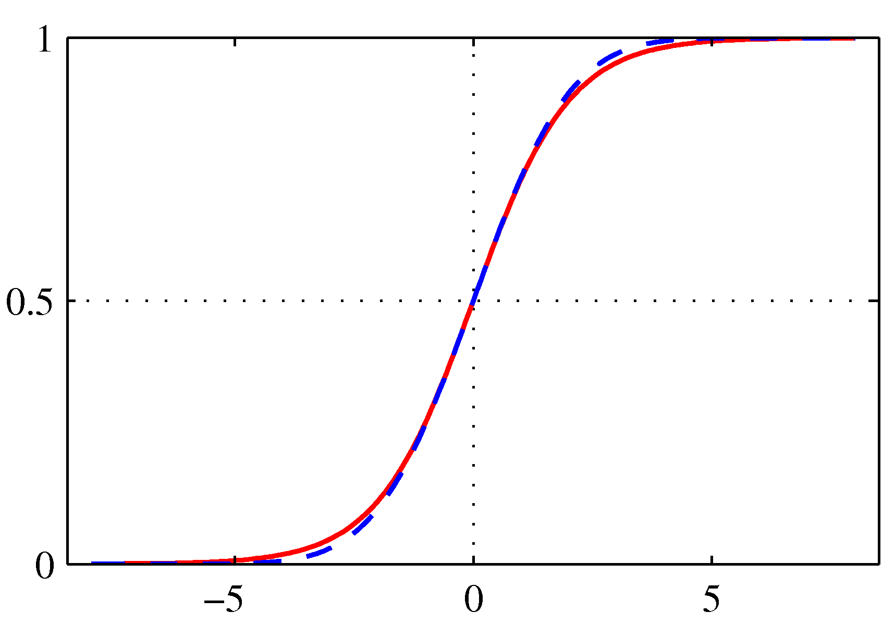

# PRML勉強会

1. [4.4 ラプラス近似](#/1)
   - [4.4.1 モデルの比較とBIC](#/2)
2. [4.5 ベイズロジスティック回帰](#/3)
   - [4.5.1 ラプラス近似](#/4)
   - [4.5.2 予測分布](#/5)
3. [まとめ](#/6)
4. [5 ニューラルネットワーク](#/7)
---

## 4.4 ラプラス近似

### これからの流れ

- 4.5で扱うベイズロジスティック回帰は、3.3, 3.5節のベイズ線形回帰のような評価は難しい
- 事後分布がガウス分布でないため、 $\mathbf{w}$ で正確な積分を取れない
- なんらかの近似が必要
  - 10章 解析的近似
  - 11章 数値的なサンプリング

### ラプラス近似

- 本章ではラプラス近似を用いる
- 目的
  - 連続変数の集合上に定義される確率密度分布をガウス分布で近似すること
- ガウス分布で近似できれば、今まで通り $\mathbf{w}$ で積分（周辺化）して予測すれば良い

### やり方の流れ

- モードを決める
- 分散をパラメータとしてフィッティングさせる

### 連続な1変数zの場合

以下の式で定義される分布 $p(z)$ を仮定する。

$p(z) = \frac{1}{Z} f(z)$ （$Z$ は $f(z)$ を $z$ について積分した正規化定数）

まずは $p(z)$ の最頻値を見つける。つまり、

$$
p(z_0)' = f(z_0)' = 0
$$

を満たす $z_0$ を見つける。

$z_0$ は数値最適化アルゴリズムで求められる（Bishop and Nabney, 2008）。

ガウス分布は、対数をとると指数部分の変数の2次関数となるので、 $f(z)$ の対数をテイラー展開を使って、2次関数で近似することを考える。

$z_0$ を中心とした $\ln f(z)$ のテイラー展開は、 $f(z_0)' = 0$ より一次の項を除いた形となり、

$$
\ln f(z) \simeq \ln f(z_0) - \frac{1}{2} \{ \ln f(z_0) \}'' (z-z_0)^2
$$

$A = \{ \ln f(z_0) \}''$ として両辺で指数をとると、

$f(z) \simeq \exp \left\{ \ln f(z_0) - \frac{A}{2} (z - z_0)^2 \right\}$

$= \exp \{ \ln f(z_0) \} \cdot \exp \{ - \frac{A}{2} (z - z_0)^2 \}$

$= f(z_0) \exp \{ - \frac{A}{2} (z - z_0)^2 \}$

となり、任意の分布 $f(z)$ について、ガウス分布と同じ形で書くことができた。正規化係数をあわせて、近似分布は

$$
q(z) = \sqrt{ \frac{A}{2 \pi} } \exp
\left\{ - \frac{A}{2} (z - z_0)^2 \right\}
$$

ただし、ルートの計算があるので、 $A>0$ つまり $f(z_0)$での2階微分が負の場合しかこの近似式は使えない。

### シグモイド関数の近似例

オレンジは $\color{orange}{p(z) \propto \exp (-z^2/2) \sigma(20z+4)}$ で、赤が近似したガウス分布。右のプロットは負の対数。

### 多次元（M次元）の場合

1変数の場合と同様に $p(\mathbf{z}) = f(\mathbf{z})/Z$ の最頻値 $\mathbf{z}_0$ を求める。

点 $\mathbf{z}_0$ では、勾配 $\nabla f(\mathbf{z})$ は0となる。この定常点の周りでテイラー展開すると

$\ln f(\mathbf{z}) \simeq \ln f(\mathbf{z}_0) - \frac{1}{2} (\mathbf{z} - \mathbf{z}_0)^T A (\mathbf{z} - \mathbf{z}_0)$

このとき、 $M \times M$ 行列 $A$ は $A = - \nabla \nabla \ln f(z_0)$ である。

1変数のときと同様に、対数をとって正規化係数を求めることで以下の近似分布が得る。

$$
q(\mathbf{z}) = \frac{|A|^{1/2}}{(2 \pi)^{M/2}} \exp \left\{
- \frac{1}{2} (\mathbf{z} - \mathbf{z}_0)^T A (\mathbf{z} - \mathbf{z}_0)
\right\} = \mathcal{N}(\mathbf{z} | \mathbf{z}_0, A^{-1})
$$

1変数と同様に、近似には条件があり、精度行列 $A$ が正定値である必要がある。つまり、定常点 $\mathbf{z}_0$ が局所最大で、局所最小または鞍点でない場合に、このガウス分布は適切に定義される。

### ラプラス近似の利点と欠点

- 利点
  - 観測データが増えるほど、中心極限定理からガウス分布による近似が良くなることが期待できる
    - データが多い状況で有用

- 欠点
  - 現実の分布は多峰的であることが多く、モードの選択によって異なるラプラス近似が存在する
    - 真の分布のある一点における局面にのみ基づいてしまう
    - 10章でより全体的なアプローチを紹介
  - ガウス分布による近似のため、実数変数の場合のみ適用可能

---

## 4.4.1 モデルの比較とBIC

前節の結果を用いて、正規化係数 $Z$ も近似することができる。

$Z = \int f(z) dz$

$\simeq f(z_0) \int \exp \left\{ - \frac{1}{2} (z - z_0)^T A (z - z_0) \right\} dz$

$$= f(z_0) \frac{(2 \pi)^{M/2}}{|A|^{1/2}} \tag{4.135}$$

この結果を用いて、モデルエビデンス $p(D)$ についても近似を行う。モデルエビデンスを近似した指標が得られれば、3.4節で議論したようにモデルの比較を行うことができる。

データ集合 $D$ とパラメータ $\{\theta_i\}$ を持つモデル集合 $\{ \mathcal{M}_i \}$ を考える。各モデルに対し、尤度関数 $p(D | \theta_i, M_i)$ を定義する。パラメータ $\{ \theta_i \}$ に関する事前確率 $p(\theta_i | M_i)$ を導入し、モデルごとのエビデンス $p(D|\mathcal{M}_i)$ を考えることができる。

### 演習4.22 ラプラス近似の結果を用いた対数モデルエビデンスの近似

$p(D)$ を $Z$, $f(\theta) = p(D | \theta) p (\theta)$ として、式(4.136) より、

$p(D) \simeq f( \theta_{MAP} ) \frac{(2 \pi)^{M/2}}{|A|^{1/2}}$

$= p(D | \theta_{MAP}, M_i) p( \theta_{MAP} | M_i) \frac{(2 \pi)^{M/2}}{|A|^{1/2}}$

対数をとると、

$$
\ln p(D) \simeq \ln p(D | \theta_{MAP}, M_i) + p( \theta_{MAP} | M_i) + \frac{M}{2} \ln (2 \pi) - \frac{1}{2} \ln |A| \tag{4.137}
$$

ここで、$\theta_{MAP}$ は事後確率分布の最頻値での $\theta$ の値である。

式(4.137)の右辺第1項は、最適なパラメータを使用して評価した対数尤度であり、残り3つの項はモデルの複雑さに対するペナルティでオッカム係数と呼ばれる。

### 演習4.23 BIC（シュワルツ規準）導出

(4.137) について、事前分布がガウス分布であることと、そのヘッセ行列が非退化（最大階数）であること仮定すれば、モデルエビデンスに対する荒い近似によってBICを導出できる。

$$
\ln p(D) \simeq \ln p(D | \theta_{MAP}, M_i) + p( \theta_{MAP} | M_i) + \frac{M}{2} \ln (2 \pi) - \frac{1}{2} \ln |A| \tag{4.137}
$$

$p(\theta_{MAP}, M_i)$ にガウス分布を仮定すると、

$\ln p(\theta_{MAP}, M_i) = \frac{M}{2}\ln 2\pi - \frac{1}{2}\ln |\mathbf{V}_0| - \frac{1}{2} (\theta_{MAP} - \mathbb{m})^T \mathbf{V}_0^{-1} (\theta_{MAP} - m)$

$\mathcal{M}_i$ は簡単のため省略すると、

$\ln p(D) \simeq \ln p(D | \theta_{MAP}) - \frac{1}{2}\ln |\mathbf{V}_0| - \frac{1}{2} (\theta_{MAP} - \mathbb{m})^T \mathbf{V}_0^{-1} (\theta_{MAP} - m) - \frac{1}{2} \ln |A|$

$$
A = - \nabla \nabla \ln p(D | \theta_{MAP} ) p(\theta_{MAP}) \tag{4.138}
$$

より、対数項の積を和に書き直すと、

$A$

$= -\nabla\nabla \ln p(D|\theta_{MAP}) - \nabla\nabla \ln p(\theta_{MAP})$

$= \mathbf{H} + \mathbf{V}_0^{-1}$

仮定した多変量ガウス分布のが平坦であるか、データ量が十分大きければ、 $\mathbf{H}$ に対して $\mathbf{V}_0^{-1}$ を無視できて、

$\ln p(D) \simeq \ln p(D | \theta_{MAP}) - \frac{1}{2}\ln |\mathbf{V}_0| - \frac{1}{2} (\theta_{MAP} - \mathbb{m})^T \mathbf{V}_0^{-1} (\theta_{MAP} - m) - \frac{1}{2} \ln |A|$

$= \ln p(D | \theta_{MAP}) - \frac{1}{2}\ln |\mathbf{V}_0| - \frac{1}{2} (\theta_{MAP} - \mathbb{m})^T \mathbf{V}_0^{-1} (\theta_{MAP} - m) - \frac{1}{2} \ln |\mathbf{H}|$

仮定したガウス分布が所与とすると、 $\mathbf{V}_0$ は定数であり、基準値としては無視して良い項となるので、

$\ln p(D) \simeq \ln p(D | \theta_{MAP}) - \frac{1}{2} (\theta_{MAP} - \mathbb{m})^T \mathbf{V}_0^{-1} (\theta_{MAP} - m) - \frac{1}{2} \ln |\mathbf{H}|$

さらに、データ点を i.i.d. と仮定すると、ヘッセ行列をデータ点ごとの影響度の和として表現できるので、その影響度の平均値を $\hat{\mathbf{H}}$ とすると、

$\mathbf{H} = N \hat{\mathbf{H}}$ より、

$\ln p(D) \simeq \ln p(D | \theta_{MAP}) - \frac{1}{2} (\theta_{MAP} - \mathbb{m})^T \mathbf{V}_0^{-1} (\theta_{MAP} - m) - \frac{1}{2} \ln |N\hat{\mathbf{H}}|$

$= \ln p(D | \theta_{MAP}) - \frac{1}{2} (\theta_{MAP} - \mathbb{m})^T \mathbf{V}_0^{-1} (\theta_{MAP} - m) - \frac{1}{2} \ln |N\hat{\mathbf{H}}|$

$\mathbf{\hat{H}}$ は $M\times M$の行列だから、最大階数であると仮定すると、

$\ln p(D) \simeq \ln p(D | \theta_{MAP}) - \frac{1}{2} (\theta_{MAP} - \mathbb{m})^T \mathbf{V}_0^{-1} (\theta_{MAP} - m) - \frac{1}{2} M \ln N - \frac{1}{2} \ln |\hat{\mathbf{H}}|$

$N$は十分大きいと仮定して他の項を無視すると、

$\ln p(D) \simeq \ln p(D | \theta_{MAP} ) - \frac{1}{2} M \ln N$

### AICとの比較

- $\mathrm{BIC} = \ln p(D | \theta_{MAP} ) - \frac{1}{2} M \ln N$
- $\mathrm{AIC} = \ln p(D | \mathbf{w}_{ML} ) - M$

- AIC, BICとも最適なモデルを選択するための指標としてよく用いられる。
- 近似の際、$N$は十分大きいと仮定していることに注意すると、AICと比較し、BICの方がモデルの複雑さにより重いペナルティを課していると分かる。

### 完全なベイズアプローチ（3.4節）との比較

- どちらの基準も評価が簡単で使いやすいが、モデルパラメータの不確実性は考慮できていない。
- BICでいえば、多くのパラメータが well-determined でない（3.5.3節 有効パラメータ数）ため、ヘッセ行列が最大階数という仮定が妥当でない。
  - そのため、Mの部分が実際より大きく見積もられており、3.4節でみた完全なベイズアプローチと比べると、過度にシンプルなモデルを選ぶ傾向がある（過学習と逆の傾向）。
  - 5.7節でベイズ的にNNを扱う際、式(4.137)を用いることで、より精度良くモデルエビデンスを推定できる。

---

## 4.5 ベイズロジスティック回帰

### これからやること

- ロジスティック回帰の厳密なベイズ推論は難しい
  - 事後確率分布の評価の難しさ
    - 事前確率分布と尤度関数（ロジスティックシグモイド関数の積）の積を全てのデータ点について計算し、正規化する必要がある
  - 予測分布の評価は、事後確率分布についての周辺化なので、同様に難しい
- そこで、ラプラス近似を用いる

---

## 4.5.1 ラプラス近似

パラメータ $\mathbf{w}$ に関する事後分布をガウス分布で近似したいので、事前分布もガウス分布と仮定するのが自然

事前ガウス分布は一般形 $p(\mathbf{w}) = \mathcal{N}(\mathbf{w} | \mathbf{m}_0, \mathbf{S}_0)$ を用いる。

ここで、$\mathbf{m}_0, \mathbf{S}_0$はある固定のハイパーパラメータである。 $\mathbf{w}$ の事後分布は、 $p(\mathbf{w} | \mathbf{t} ) \propto p(\mathbf{w}) p(\mathbf{t} | \mathbf{w})$ で与えられる。両辺の対数をとって、事前確率分布と尤度関数の定義から、対数事後確率分布を導出する。

$$ \ln p(\mathbf{w} | \mathbf{t} ) \\
= - \frac{1}{2} (\mathbf{w} - \mathbf{m}_0)^T S_0^{-1} (\mathbf{w} - \mathbf{m}_0) \\+ \sum_{n=1}^N \{ t_n \ln y_n + (1 - t_n) \ln (1 - y_n) \} + const$$

ただし、 $y_n = \sigma(\mathbf{w}^T \phi_n)$ である。

この事後確率分布を最大化すると、最大事後確率解 $\mathbf{w}_{MAP}$ が得られる。これは、ガウス分布における、最頻値かつ平均値である。

共分散は、負の対数尤度における2階微分行列の逆行列であり、

$$
S_N^{-1} = - \nabla \nabla \ln p(w| \mathbf{t} ) \\
= S_0^{-1} + \sum_{n=1}^N y_n ( 1 - y_n) \phi_n \phi_n^T
$$

となる。

よって、事後確率分布のガウス分布による近似は $q(\mathbf{w}) = N(\mathbf{w} | \mathbf{w}_{MAP}, S_N)$ となる。

後は、予測分布を得るために、この近似ガウス分布を積分して周辺化すればよい。

---

## 4.5.2 予測分布

新たな特徴ベクトル $\phi(x)$ が入力された際のクラス $C_1$ に対する予測分布は、事後確率分布 $p(\mathbf{w}|\mathbf{t})$ に関して周辺化して得られる。つまり、

$$
p(C_1 | \phi, \mathbf{t} ) = \int p(C_1 | \phi, \mathbf{w})p(\mathbf{w}|\mathbf{t})d\mathbf{w}
\simeq \int \sigma(\mathbf{w}^T \phi) q(\mathbf{w}) d\mathbf{w}
$$

2クラス問題を考えると、クラス $C_2$ に対する予測分布は $p(C_2 | \phi, \mathbf{t} ) = 1 - p(C_1 | \phi, \mathbf{t} )$ で与えられる。

$a=\mathbf{w}^T\phi$ とすると、

$p(C_1 | \mathbf{t} ) = \int \sigma(a) \mathcal{N}(a | \mu_a, \sigma_a^2 ) da$

$\mu_a = \mathbf{w}_{MAP}^T \phi$

$\sigma_a^2 = \phi^T S_N \phi$

前節の結果を用いて、事後分布をガウス分布に近似した結果、予測分布はシグモイド関数でのガウス分布の畳み込み積分となった。解析的な評価は難しいので、シグモイド関数 $\sigma(a)$ をプロビット関数の逆関数 $\Phi(\lambda a)$ を使って近似することを考える。

$\lambda$ は $\lambda^2=\pi/8$ であり、下の図のように $a=0$ での両者の傾きをそろえるための定数。

これにより畳み込み積分の結果別のプロビット関数の逆関数で解析的に評価でき、

$\int \Phi(\lambda a) \mathcal{N}(a | \mu_a, \sigma_a^2 ) da = \Phi \left(\frac{\mu}{(\lambda^{-2} + \sigma^2)^{1/2}}\right)$

$\kappa(\sigma^2) = (1+\pi\sigma^2/8)^{-1/2}$ として、$\Phi$ を $\sigma$ に戻すことで、以下の近似予測分布を得る。

$p(C_1 |\phi, \mathbf{t} ) = \sigma\left( \kappa (\sigma^2_a) \mu_a \right)$

- $p(C_1 |\phi, \mathbf{t} ) = 0.5$ となる決定境界は $\mu_a = 0$ で得ることができ、 $\mathbf{w}$ の最大事後確率値と等しい。
- なので、事前確率が一様で、目的が誤分類最小化の場合は、周辺化によるベイズ的な取り扱いに意味はない（分布を利用して複雑な決定規準を定める際に使う）
- ラプラス近似の下でのロジスティックシグモイドモデルの周辺化は、変分推論の枠組みで図10.13で説明される。

---

## まとめ

- ラプラス近似は、モードを定めてガウス分布でフィッティングを行う手法のこと
- 近似の過程でモデルエビデンスも荒く近似することができ、これはモデル選択に使えるBICとなった
- ロジスティック回帰（分類）をベイズ的に扱う際、解析的な評価の難しさを近似によって解決できた

---

## 5 ニューラルネットワーク

### これまでの流れ

- 3・4章でみた線形モデルは解析しやすいメリットがあった
- が、次元の呪いのために実際の応用は限られていた
- 基底関数をデータに適応させる必要がある

### SVM（7章）

1. 訓練データ点を中心とした基底関数群を定義
2. 訓練中に↑の一部を選択

- 訓練は非線形最適化だが、目的関数は常に凸であり最適化しやすい
- 基底関数はデータ点よりも遥かに少なくなる
- が、一般的にはまだ多い
- 訓練集合の増加とともに増加する

### RVM(7.2節)

- SVM同様、固定された基底関数の一部を選択
- SVMよりは基底関数が少ない
- SVMと異なり確率を出力できる
- が、訓練時に非凸最適化が必要

### （フィードフォワード）ニューラルネットワーク

- 事前に基底関数の数は固定し、適応的に配置する
  - 基底関数に対してパラメトリックな関数を使い、パラメータを訓練で学習
- 多層パーセプトロンとも
  - 不連続な非線形性を持つ複数のパーセプトロンではなく
  - 連続的な非線形性を持つ多層ロジスティック回帰モデル
- 多くの場合、同じ汎化性能を持つSVMよりコンパクト
  - 評価も高速
- RVM同様、尤度関数はパラメータについての凸関数にならない
  - が、実用上は学習の多くの時間を割いてでも、新規のデータを高速に評価できる方が良いのでOK

### ニューラルネットワークの起源

- 起源は生体システムの情報処理を数学的に表現しようとする試み(McCulloch and Pitts, 1943)
- 生物学的な妥当性には批判もあるが、応用的観点からは不要な制約
- → 実用的な多層パーセプトロンについてみていく

### 5章の議論の流れ

- 5.1 ネットワークモデルの関数の形について
  - 基底関数をどのようにパラメータ表示するか？
- 5.2 最尤推定でのパラメータの決定
  - 非線形最適化問題をどのように解くか？
  - 5.3 対数尤度関数のパラメータについての微分をどう効率的に得るか？（誤差逆伝播）
  - 5.4 誤差逆伝播の拡張（ヤコビ・ヘッセ行列の評価）
- 5.5 ニューラルネットワークの正則化
- 5.6 ニューラルネットワークモデルの拡張
  - 混合密度ネットワーク
    - 条件付き確率分布のモデル化
- 5.7 ベイズ的ニューラルネットワーク
- NNに関するその他の背景は (Bishop, 1995a) を参照
