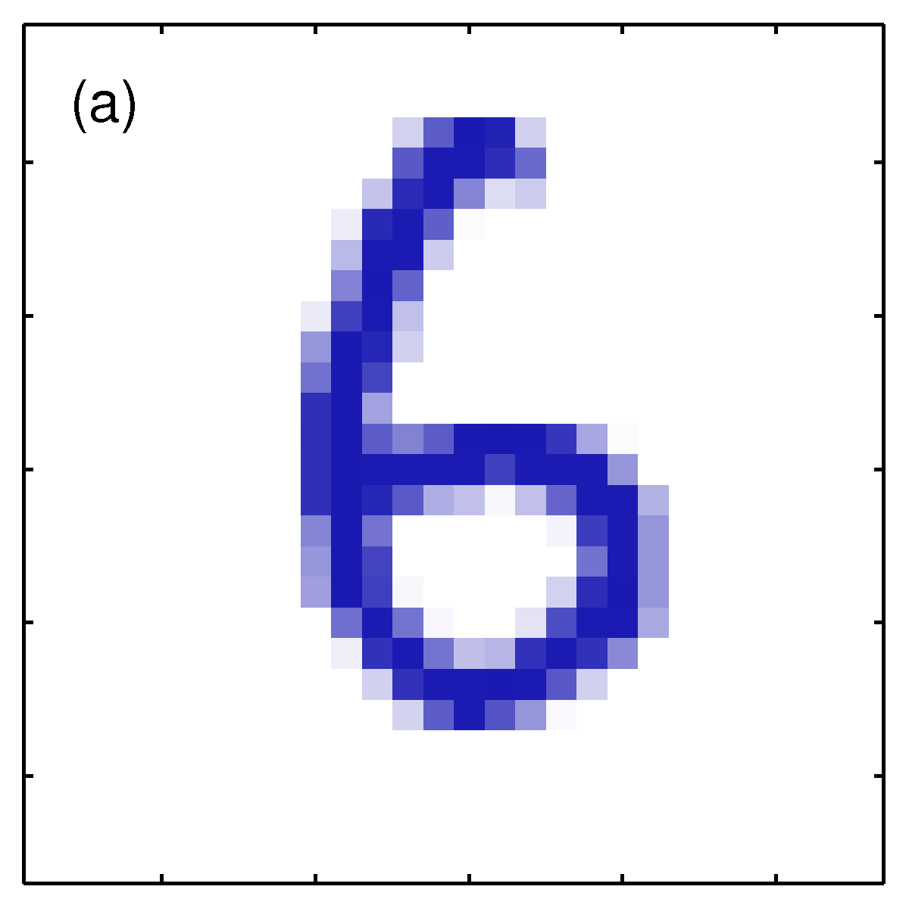
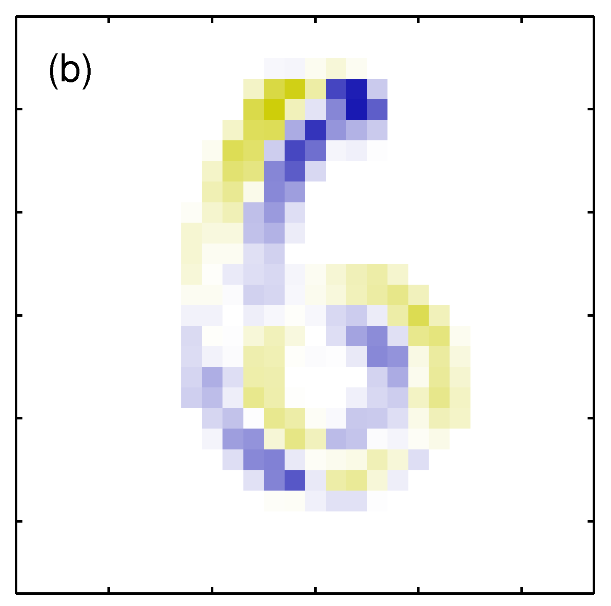
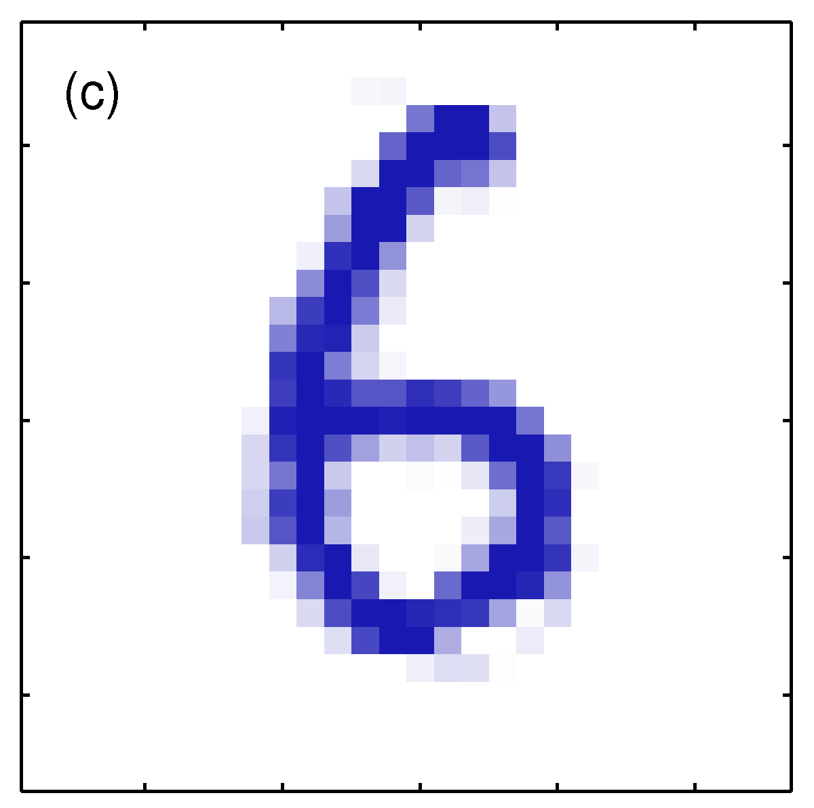
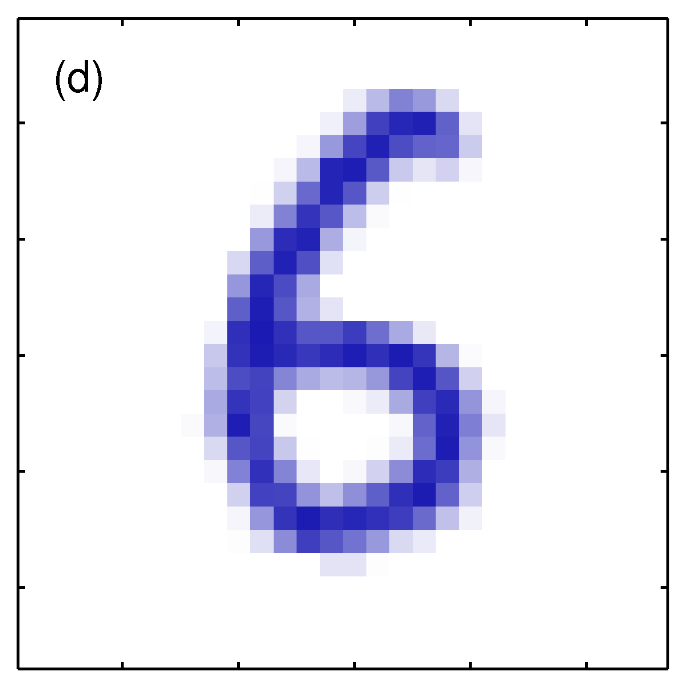

# PRML勉強会

1. [5.5.3 不変性](#/1)
2. [5.5.4 接線伝播法](#/2)
3. [5.5.5 変換されたデータを用いた訓練](#/3)

---

## 5.5.3 不変性

--

### 5.5.3 不変性

パターン認識では、入力データに対する変換がかかっても、結果が不変であることがしばしば求められる。

- 平行移動不変性
- 尺度不変性（サイズに対する不変性）
- 時間的な伸縮に対する不変性

--

### 不変性のための4つのアプローチ

そのためには大きく4つのアプローチがある。

1. **data augmentation**: 学習データ集合を変換してかさ増しする(5.5.5)
2. **接線伝播法**(5.5.4)
3. 変換に対して不変な特徴量を抽出する
4. **たたき込みニューラルネットワーク**(5.5.6)

--

#### アプローチ１. **data augmentation**: 学習データ集合を変換してかさ増しする(5.5.5)

--

#### アプローチ１. **data augmentation**: 学習データ集合を変換してかさ増しする(5.5.5)

- メリット
  - 実装が容易で一般的かつ複雑な不変性にも応用可能
  - オンライン学習では、毎回与えるデータにランダムな変換を施す
  - バッチ処理では、独立な変換をデータ集合に施す
- デメリット
  - 学習データ数も増えるので、計算量が増える。

--

#### アプローチ2. 接線伝播法(5.5.4)

- 正則化項を誤差関数に加えることで不変性の崩れにペナルティを課す
- 5.5.5節で、アプローチ1との密接な関係を議論

--

#### アプローチ3. 変換に対して不変な特徴量を抽出する

- これができたらその後にどんな回帰や分類を行っても不変性は維持されるが、、特に方法論などは書かれていない（職人芸）
- NNはこれを勝手にやってくれると考えることもできる（隠れ層が特徴量を抽出している）
  - transfer learning などは、その特徴量としての不変性を利用しているとも考えられる

--

#### アプローチ4. たたき込みニューラルネットワーク(5.5.6)

- 学習器内部に不変性を構築する
  - NNであれば構造に
  - 局所的受容野の重みを共有する
  - RVMであればカーネル関数の定義に

---

## 5.5.4 接線伝播法

--

### 5.5.4 接線伝播法

$$
\tilde{E} = E + \lambda \Omega
$$

- 正則化項を用いてモデルに入力に対する不変性を持たせる
  - 入力に対して出力が変化する度合い $\Omega$ を導き出せば良い

--

#### 5.5.4 変換が連続な場合を考える

- 入力データへの変化が連続（例えば平行移動や回転、鏡面は含まない）な場合、入力空間上で変換前後のデータ座標も連続的に変化する。
- 2次元の入力データ $x_n$ をに対し、連続変数 $\xi$ だけ少しずつ変換させたときの $x_n$ の座標点の軌跡を表すと、局所的な変換の影響は接ベクトル $\tau_n$ として扱える。

--

#### 変換による軌跡としての多様体 $\mathcal{M}$

- $\tau_n$: 局所的な変換の影響を表す接ベクトル
- $\xi$: 変換のパラメータ
- $x_n$: 2次元の入力データ

--

#### 5.5.4 接線伝播法

- aは元画像
- bは無限小の時計回りの回転に対する接ベクトル $\tau$ （正, 負)
- cは$\epsilon=15^\circ$ で $x+\epsilon\tau$
- dは回転させた真の画像

--

#### 5.5.4 接線伝播法

入力が変化すると一般に出力も変化する。入力データへの微小な変化 $\xi$ を作用させたときの出力ユニット $k$ の変化度合い(微分)は、$D$ を入力データの次元として

$$\left. \frac{ \partial y_k }{ \partial \xi } \right|_{ \xi=0} \tag{5.126}$$

$= \left. \sum_{i=1}^D \frac{ \partial y_k }{ \partial x_i } \frac{\partial x_i}{\partial \xi} \right|_{\xi=0}$

$= \sum_{i=1}^D J_{ki} \tau_i$

--

#### 5.5.4 接線伝播法

- $\partial y_k / \partial x_i$ は出力の入力に関する微分だから、ヤコビ行列 $J$ 。
  - $J_{ki}$ は $J$ の $(k,i)$ 成分
- $\partial x_i / \partial \xi$ は接ベクトル $\tau_n$ で、実際には有限幅の差分による近似で求める。

--

#### 5.5.4 接線伝播法

この式 (5.126) は入力の変化に対する出力の変化具合なので、この値を正則化関数 $\Omega$ に用いる。

$$
\tilde{E} = E + \lambda \Omega \tag{5.127}
$$

--

#### 5.5.4 接線伝播法

$$
\tilde{E} = E + \lambda \Omega \tag{5.127}
$$

- $\Omega$ は、データ点と出力ユニットについて5.126の総和をとったもの。
  -  それぞれのベクトル近傍において、ネットワーク関数がその変換のもとで不変であれば0となるような関数。
- $\lambda$ は正則化係数で、訓練データに対するフィッティングと不変性の学習のバランスを決定する。
- 変換のパラメータを多次元にしても、局所的な不変性は維持できる（Simard et al., 1992）

<!-- - データ点が変わると入力空間上の座標が変わるので接ベクトルが変化するので、接ベクトル $\tau$ にはデータ点に関するインデックス $n$ と、その方向についての添字 $i$ がついている。
- 訓練済みのニューラルネットワークは非線形になるので、入力データが新しくなるたびにヤコビ行列を再評価する必要がある（5.3.4 ヤコビ行列）ことから、ヤコビ行列 $J$ にもデータ点に関するインデックス $n$ をつけて $J_n$ と表記。 $J_{nki}$ は入力データ $x_n$ に関するヤコビ行列の $(k,i)$ 成分。

以上の表記を使って正則化関数 $\Omega$ は

$$
\Omega = \frac{1}{2} \sum_n \sum_k \left(
\left. \frac{ \partial y_{nk} }{ \partial \xi } \right|_{ \xi=0}
\right)^2
=
\frac{1}{2} \sum_n \sum_k \left(
\sum_{i=1}^D J_{nki} \tau_{ni}
\right)^2 \tag{5.128}
$$

と書ける。 -->

---

## 5.5.5 変換されたデータを用いた訓練

--

### **data augmentation**

以下の二つのアプローチには、密接な関係がある

1. **data augmentation**: 学習データ集合を変換してかさ増しする(5.5.5)
2. 接線伝播法(5.5.4)

具体的には、誤差関数が一致する。

--

### 誤差関数

まず、 **data augmentation** を行う際、データ集合が無限となる極限で二乗和誤差関数は

$E = \frac{1}{2} \int \int \\{ y(\mathbf{x}) -t \\} ^2 p(t | \mathbf{x}) p(\mathbf{x}) d\mathbf{x}dt$

- 出力は1つと考える

--

### **data augmentation**

- 変換のパラメータも $\xi$ 1つ
- それぞれのデータ点が $p(\xi)$ で選ばれるパラメータ $\xi$ によって無限にコピーされており、
- $\mathbf{s}$ を $\mathbf{s} (\mathbf{x}, 0) = \mathbf{x}$ となるような変換関数と考えると、誤差関数は

$\tilde{E} = \frac{1}{2} \int \int \int \\{ y( \mathbf{s}( \mathbf{x}, \xi ) ) -t \\} ^2 p(t | \mathbf{x}) p(\mathbf{x}) p(\xi) d\mathbf{x} dt d\xi$

$$\tag{5.130}$$

--

#### テイラー展開による式変形

$\xi$ の冪乗にテイラー展開すると、

$\mathbf{s}( \mathbf{x}, \xi ) = \mathbf{s}( \mathbf{x}, 0)$

$+ \left . \xi \frac{\partial}{\partial\xi} \mathbf{s}( \mathbf{x}, \xi ) \right|_{ \xi=0}$

$+ \left . \frac {\xi^2} {2} \frac{\partial^2}{\partial\xi^2} \mathbf{s}( \mathbf{x}, \xi ) \right|_{ \xi=0}$

$+ O(\xi^3)$

$= \mathbf{x} + \xi\mathbf{\tau} + \frac{1}{2} \xi^2 \mathbf{\tau}' + O(\xi^3)$

- $\mathbf{\tau}'$ は $\xi = 0$ における $\mathbf{s}( \mathbf{x}, \xi )$ の二階微分

--

### 誤差関数の整理

この結果を用いて $p(\xi)$ は平均0の小さなパラメータと考えて、 $O(\xi ^3), \mathbb{E}[\xi]$ を0として 5.130 の誤差関数を整理すると

$\tilde{E} = E + \mathbb{E} [\xi ^ 2] \frac{1}{2} \int \\{ f \times g + (\mathbf{\tau}^T \nabla y(\mathbf{x}))^2 \\} p(\mathbf{x}) d\mathbf{x}$

ただし、

$f = \\{ y (\mathbf{x}) - \mathbb{E}[t| \mathbf{x}] \\}$

$g = \\{ \mathbf{\tau}'^T \nabla y(\mathbf{x}) + \mathbf{\tau}^T \nabla\nabla y(\mathbf{x}) \tau \\}$

--

### 誤差関数の整理

1.5.5節で、二乗和誤差を最小化する関数は、目標値 $t$ の条件付き期待値 $\mathbb{E} [t|\mathbf{x}]$ となるとわかった。先ほどの $f \times g$ は $O(\xi^2)$ なので、全体の誤差を最小化するネットワーク関数は

$$y (\mathbf{x}) = \mathbb{E}[t|\mathbf{x}] + O(\xi^2) \tag{5.133}$$

よってこのとき $y (\mathbf{x}) - \mathbb{E}[t|\mathbf{x}] = O(\xi^2)$ となり、先ほどの $f$ がかかった項を無視できて、

$\tilde{E} = E + \mathbb{E} [\xi ^ 2] \frac{1}{2} \int (\mathbf{\tau}^T \nabla y(\mathbf{x}))^2 p(\mathbf{x}) d\mathbf{x}$

--

### 接線伝播法と **data augmentation**

$\mathbb{E}[\xi^2]$ を $\lambda$ とすると、

$$
\tilde{E} = E + \lambda \Omega \tag{5.131}
$$

$$
\Omega = \frac{1}{2} \int (\mathbf{\tau}^T \nabla y(\mathbf{x}))^2 p(\mathbf{x}) d\mathbf{x} \tag{5.134}
$$

- これは接線伝播法の正則化項と等価。
- → データのかさ増しも、接線伝播法も、変換が小さくデータが無限の極限では同じこと

--

### ティホノフ正則化

$\mathbf{x} \rightarrow \mathbf{x} + \mathbf{\xi}$ のときを考えると、

- $\Omega = \frac{1}{2} \int \\|\nabla y (\mathbf{x})\\| ^2 p(\mathbf{x}) d\mathbf{x}$
- これをティホノフ正則化という
- 乱数ノイズを入力に付加している
- 適当な環境では汎化性能を向上させる（Sietsma and Dow, 1991）
