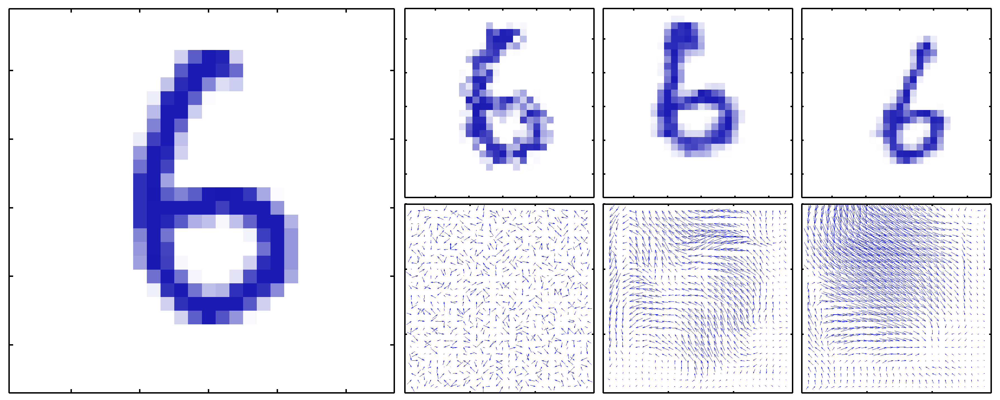
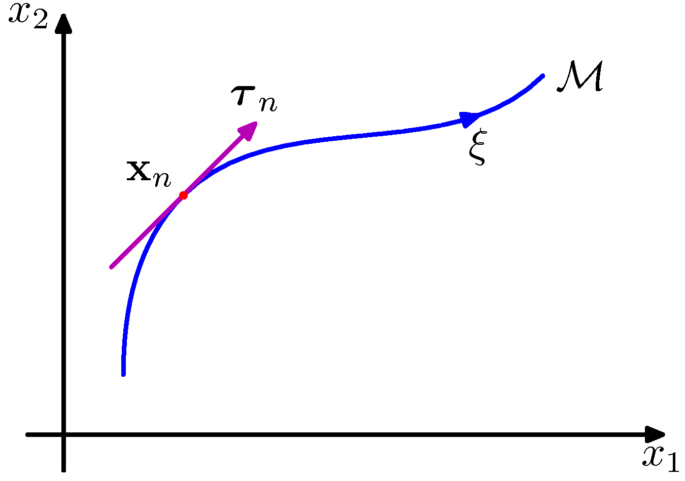

# PRML勉強会

1. [5.5.3 不変性](#/1)
2. [5.5.4 接線伝播法](#/2)
3. [5.5.5 変換されたデータを用いた訓練](#/3)

---

## 5.5.3 不変性

---

## 5.5.4 接線伝播法

- a
  - 元画像
- b
  - 無限小の時計回りの回転に対する接ベクトル $\tau$ （正, 負）
- c
  - $\epsilon=15^\circ$として、 $x+\epsilon\tau$
- d
  - 回転させた真の画像

---

## 5.5.5 変換されたデータを用いた訓練
