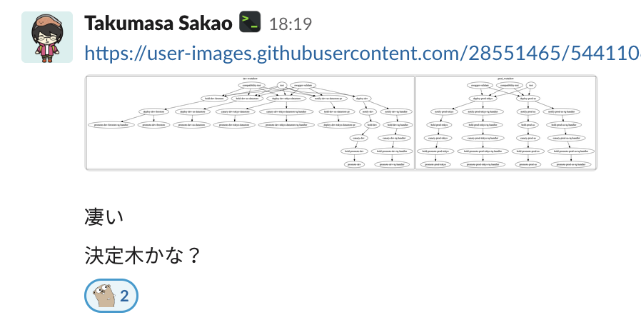

# Akatuki

## エンジニアインターン

in

## ATLASチーム

---

## 目次

1. [自己紹介](#/2)
2. [やったこと](#/3)
3. [やっていて良かったこと](#/4)
4. [感想](#/5)

---

## 自己紹介

---

## やったこと

--

<p style="text-align:left;">やったこと</p>

- スタックトレースが出るようにするためのエラーハンドリング周りのリファクタリング

--

<p style="text-align:left;">やったこと</p>

- エラーハンドリング周りの静的解析リンターの改善
  - case文に対応したりした。
  - 静的解析に触れられてよかった。

--

<p style="text-align:left;">やったこと</p>

- エラーハンドリング周りの静的解析リンターの改善
  - SSAなどの概念を知れてよかった。
  - Go言語の内部実装などもついでに読めて、ツールが整っていてかつGo自身で書かれているのが改めて良いと感じた。

--

<p style="text-align:left;">やったこと</p>

- エラーハンドリング周りの静的解析リンターの改善
  - xerrorsという新しいバージョンの標準パッケージに対応する linter（OSS版）にもプルリクを出せた(プライベートで)
  - [link](https://github.com/sachaos/xerrchk/pull/2)

--

<p style="text-align:left;">やったこと</p>

- 重いサービスの別サービス化とそれに伴うCIの更新
  - ミスると大変そうだった
  - なんどか叩き台を提案したが、その度に最もな指摘を頂いて、自分の設計能力の甘さを再認識できた。

--

<p style="text-align:left;">やったこと</p>

### 直面した問題

- どんどん伸びる `circleci.yml`
  - `circleci.yml` は CI だから基本走る（走らせたくない部分は filter する）と考える。
  - workflowごとに `require` をたどっていけば長くてもコメントを頼りに読める。
  - ↑は可視化ツールのおかげです。

--

<p style="text-align:left;">やったこと</p>

### 直面した問題



--

<p style="text-align:left;">やったこと</p>

### 直面した問題

- 動かないSDK

```python
  def _HeadersFromTask(self, task, queue):
    headers = []
    for header in task.header_list():
      header_key_lower = header.key().lower()

      if header_key_lower == 'host' and queue.target is not None:
        headers.append(
            (header.key(), '.'.join([queue.target, self._default_host])))
      elif header_key_lower not in BUILT_IN_HEADERS:
        headers.append((header.key(), header.value()))
    # headers.append(('host', 'localhost:8081'))
```

--

<p style="text-align:left;">やったこと</p>

### 直面した問題

- 任意のスライスをエンコードしてログに出すという目的のために `reflect` を使っており、それの切り出しをどうするかが難しかった。
- 既存のコードでは `SliceTo~` という命名で使っており、 `slice` 以外を受け取ると `panic` するが、名前が名前なので良さそうではある。

--

<p style="text-align:left;">やったこと</p>

### 直面した問題

- これを抽象化して `encode~` といった副作用のない関数に切り出してテストする必要があり、この命名で `slice` 以外を受け取ると `panic` するというのはあまりに理不尽だと思い困った。

--

<p style="text-align:left;">やったこと</p>

### 直面した問題

- `Go` はジェネリックがないからつらい、とよく聞いたが、本質的にジェネリックは `panic` を起こしやすい機能だと思うので、簡単にはそれを組み込もうとしない、というのは合理的にも感じた。
- 最終的に外部で使う `exported` な関数の名前を `AddSliceTo~` と改名することで乗り切った。

--

<p style="text-align:left;">やったこと</p>

### 直面した問題

- `panic` を起こす点では変わりないが、互換性を保ちながらのリファクタリングというスコープだったのと、さすがにすべての型に対して専用の関数を入れるのは厳しいので、これで良いと感じた。
- コメントで  `slice` 以外を受け取ると `panic` するということを強調しておいた。
- 最終的には `error` を返すように改修した。

---

## やっていて良かったこと

--

<p style="text-align:left;">やっていて良かったこと</p>

- 質問、日報のgit管理
  - 共有できる。
  - 後からコピペできる。
  - 思いついたこと、忘れがちなメモなどを残せる

--

<p style="text-align:left;">やっていて良かったこと</p>

- とりあえず理解できないコードも通しで読んでおく
  - コメントとかで重要な情報が拾える
  - 後からキーワードで思い出せる
  - 大体のボリューム感がわかる。
  - 会話のタネになる。

--

<p style="text-align:left;">やっていて良かったこと</p>

- docの整理
  - 環境構築はだいたい詰まる
  - 新しく入った人が詰まった部分をdocに追記していくのがよい

---

## 感想

--

<p style="text-align:left;">感想</p>

- 今回のプロジェクトは人がいなくて大変そうだった。
- フルで会社にいた方のうち
  - CTOさんは他の仕事も山のようにあった。
  - メンターさんは2人のインターンを抱えていて、大変そうだった。

--

<p style="text-align:left;">感想</p>

- GCP勉強会
  - 使っているクラウドに関して、最新の話題を知れてよかった。
  - 興味のある話題を、他の人の知識なども聞きながら話せてよかった。
- 業務時間内に勉強会できるのは感動した。

--

<p style="text-align:left;">感想</p>

- Github にもう少し慣れておきたかった。
  - Tag をプッシュして恥をかく、など

--

<p style="text-align:left;">感想</p>

- 別サービス化したサービスのインスタンスクラスについての議論
  - IOの待ち時間が多くを占めるから非同期に処理できる数を増やしたほうがよく、そのためには `max_concurrent_request` の指定ができるF2が良いという意見
  - 計測する前に推測している状態で設定を最適化すべきでない、という意見
  - 議論のレベルがとても高く、自分の考えの浅さが理解できた。

--

<p style="text-align:left;">感想</p>

### 健康的だった

- 弁当
- 朝会

--

<p style="text-align:left;">感想</p>

### 楽しく働けた

- 歓迎ランチ
- 進捗がある
  - 朝回
  - 日報
  - 質問しやすい環境
  - 結果的に生産性が高い

--

<p style="text-align:left;">感想</p>

### 楽しく働けた

- ツールが良い
  - github, g amba!, TeamSpirit, CircleCIなど
  - UI、デザインや操作性の悪い自社サービスを無理して使うと辛いので。
- 毎日早起きできたのが楽しかった証拠だと思う。

--

<p style="text-align:left;">感想</p>

### 楽しく働けた

- メンターさんの詳しい領域についての話がかなり勉強になった。
  - Go111では基本的に任意のコード実行ができるので頑張れば tensorflow/go も導入できるはず、など
- 有名なOSSを作っていた人や、自身で作ったプロダクトで賞をとった人が周りにいるため、刺激をもらえる。

--

### オフィスがきれい

- ラウンジ
- 執務スペースと休憩スペース
- 会議室

---

## ありがとうございました 🎉

---

## 質問（あれば）