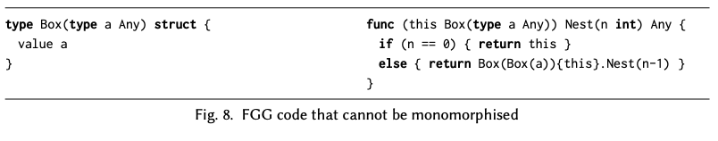
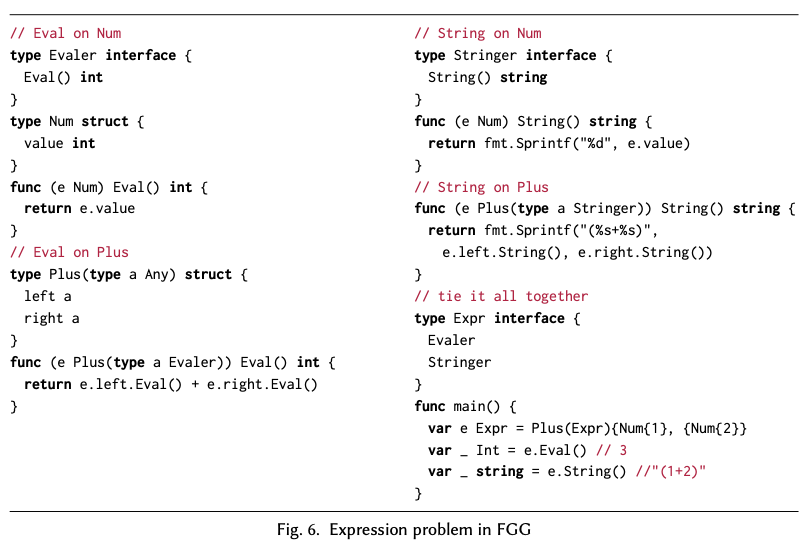
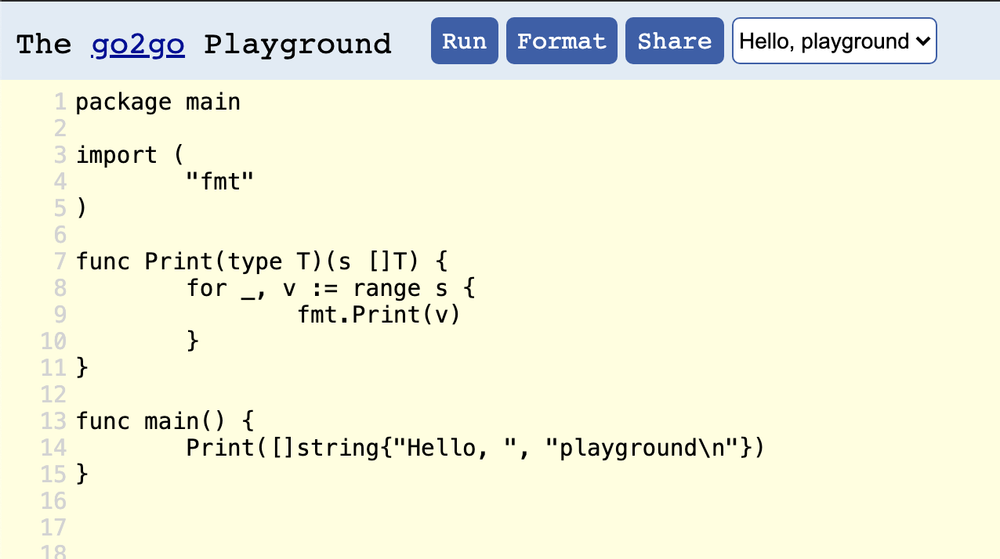

## Featherweight Go

Robert Griesemer, Raymond Hu, Wen Kokke, Julien Lange, Ian Lance Taylor, Bernardo Toninho, Philip Wadler, Nobuko Yoshida

---

## 目次

1. [概要](#/2)
2. [背景](#/3)
3. [Monomorphisation](#/4)
4. [Expression Problem](#/5)
5. [まとめ](#/6)

---

## 1. 概要

- どうGoにジェネリクスを導入するか
  - 新しく contract を導入するのではなく
  - 既存の interface を拡張することで実現することを提案
- Monomorphisation を初めて定式化
  - 関数型的な側面に焦点を当てた軽量なモデル言語 Featherweight Go に対して、健全性や停止性などを証明
- 後方互換性を保ちながらExpression Problemも解決

---

## 2. 背景

--

### From Rob Pike to one of the authors

*Would you be interested in helping us get polymorphism right (and/or figuring out what “right” means) for some future version of Go?*

*This paper is our response to that question.* 

↑ かっこいい

--

### 人名（余談）

- Rob Pike
  - Unix, UTF-8, Go などの作者として有名
- Philip Wadler （著者の一人）
  - Haskell の設計などで有名
  - Expression Problem を指摘した人

--

### Contract

```Go
package compare
// The equal contract describes types that have an Equal method with
// an argument of the same type as the receiver type.
contract equal(T) {
	T Equal(T) bool
}
// Index returns the index of e in s, or -1.
func Index(type T equal)(s []T, e T) int {
	for i, v := range s {
		// Both e and v are type T, so it's OK to call e.Equal(v).
		if e.Equal(v) {
			return i
		}
	}
	return -1
}
```

go.googlesource.com/proposal/+/master/design/go2draft-contracts.md

--

### Contract

- 以前から提案されていたジェネリクスのための構文
- 著者ら曰く、便利な構文だが、意味論が不明瞭らしい
  - 正確な批判は読んだ限り書いていなかった 

--

### Duck Typing

```Go
type Any interface {}

type Eq interface {
  Equal(that Eq) bool
}

type empty struct {}
```

- Go では、 `interface` という構文で定義された関数の組を実装すると、その型として使うことができる
- ↑でいうと、 `empty` は `Any` ではあるが、 `Eq` ではない

--

### Complete vs Featherweight

- レビュワー
  - できるだけ多くの機能をモデル化(Complete)した方が、機能の直交性なども分析できて良いのでは？
- 著者ら
  - Featherweight Java の引用数が、その他の Complete なモデル化を行った研究よりも多いことを根拠として、 Featherweight Go の価値を主張

---

## 3. Monomorphisation

- ジェネリックな型を具体的な型に当てはめていく処理（単一化）
- FGG(Featherweight Generic Go) → FG(Featherweight Go) と変換する
- 例ですら長いので省略...

--

### 証明された性質

いろいろあるが...
- 健全性
- 停止性
  - 単一化不可能であれば、そう返して終了することができることを証明
- C++, ML, .NET, Rust などで使われるポピュラーなものだが、今回初めて定式化された。

--

### 単一化不可能なコードの例



- polymorphic recursionと呼ばれる
- 実行時までどれだけ型がネストするか不明
- 論文では、 problematic polymorphic recursion が存在しなければ、単一化可能なことも証明している。

---

## 4. Expression Problem

型安全性を保ちながら、再コンパイルせずに、ジェネリックな型に対して、新しいメソッドや具体的な型を追加するにはどうすれば良いか？

--

### 関数型の場合（Haskell）

データを追加すると、データを使っている全ての関数に対して変更が散らばる

```haskell
data Expr = Const Int | Add Expr Expr

toString (Const i) = show i
toString (Add e1 e2) = toString e1 ++ " + " ++ toString e2

eval (Const i) = i
eval (Add e1 e2) = eval e1 + eval e2
```

- 関数は追加するだけで良いが、、、
- dataの種類（引き算など）を追加すると、全てに変更が必要になる
- Haskell は型クラスで解決

--

### OOPの場合（C++）

```C++
class Expr {
public:
  virtual string to_string() const = 0;
  virtual int eval() const = 0;
};

class Const : public Expr {
public:
  Const(int value) : value_(value) {}
  string to_string() const {
    std::ostringstream ss; ss << value_;
    return ss.str();
  }
  int eval() const {
    return value_;
  }
private:
  int value_;
};

class Add : public Expr {
public:
  Add(const Expr& e1, const Expr& e2) : e1_(lhs), e2_(rhs) {}
  std::string to_string() const {
    return e1_.to_string() + " + " + e2_.to_string();
  }
  double eval() const {
    return e1_.eval() + e2_.eval();
  }
private:
  const Expr& e1_; const Expr& e2_;
};
```

今度はメソッド追加のたびに、全ての実装に変更が必要

--

### OOPの場合（C++）

- [この場合visitorパターンを拡張して解決するらしい](https://cs.brown.edu/~sk/Publications/Papers/Published/kff-synth-fp-oo/)
- templateでもOK?

--

### Go



--

### Go

- `type Minus` を追加したい場合は、別モジュールに `Evaler` と `Stringer` を追加すれば良い
- メソッド `String` を追加するのも、後から `interface` と実装を書いて埋め込むだけで済んでいる。
  - duck typing に則って、 `Evaler` かつ `Stringer` であれば、自動的に `Expr` となる。
- 操作の追加も構造の追加も、凝集度が高い
- 後方互換性あり（なので今後実装される模様）

---

## 5. まとめ

- どうGoにジェネリクスを導入するか
  - 新しく contract を導入するのではなく
  - 既存の interface を拡張することで実現することを提案
- Monomorphisation を初めて定式化
  - 健全性や停止性などを軽量なモデル言語 featherweight go に対して証明
  - ただし lead to explosion in code size.
- 後方互換性を保ちながらExpression Problemも解決

--

#### そもそもジェネリクスの何が嬉しいか？

- Go でいろいろな型を受け取って同じようなことを処理するのが楽になる。
  - 順序づけられる型に対する 
    - sort, min, max など
- Reflection で実行時に型をいじったり、コード生成して解決していたものの一部が、型安全にネイティブの機能で実現できるようになる。

--

### 実際に試せる

- 著者らによる実装
  - https://github.com/rhu1/fgg/
- 公式のデモ（どこまで同じかは不明）

[](https://go2goplay.golang.org)

--

### Future Works

- .NET generics のように実行時型情報を使う手法との組み合わせ
- Bantamweight Go
  - assignments, arrays, slices, packages なども含めたモデル化
- Cruiserweight Go
  - goroutines, message passing のモデル化
