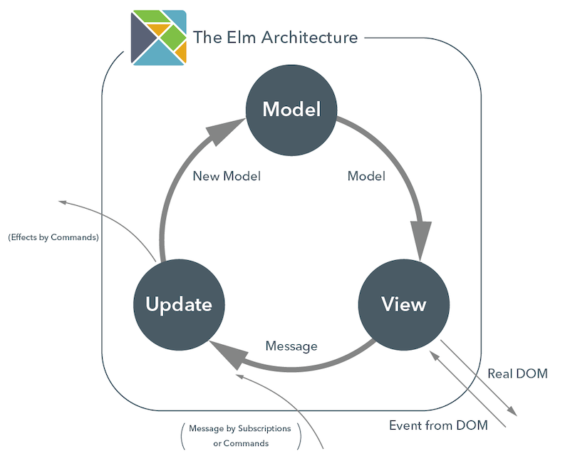
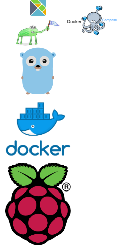

## IoTリモコン制作実習

<small>[Masahiro Matsui](https://tech-navy.tech)</small>

Github

Slide

note: 最初のページ。URLのバーコードがあるので画面を長めに表示しておく。

---

### 目次

1. [ライトトグル用リモコン](#/2) 
2. [Elm版Webリモコン](#/3)
3. [環境構築](#/4)
4. [研究の方針](#/5)

---

# やったこと

--

- ライトトグル用リモコン（ラズパイ上）
- Elm版Webリモコン
- ↑が乗る環境の構築
- 研究の方針を考える

---

# Elm版Webリモコン

--

# Elmとは？

--

#### Elm Architecture

---

# 環境構築

--

--

- Makefile (webpack、rsync等を自動化)
- ローカルアドレスの付与
- 80版ポートへのバインド
- コンテナ内へのデバイス権限の受け渡し
- コンテナ→Go→Lisp→Server→Elm
- Elmに環境変数をWebpack経由で付与

---

# 研究の方針

---

## 引用

- The Elm Architecture のイメージ図 https://qiita.com/A_kirisaki/items/8fa5563a035c8c4d977c より引用
- ラズベリーパイのロゴは公式サイトから http://www.raspberrypi.org
- docker のロゴは公式サイトから https://www.docker.com/legal
- gopher-front.{ai,svg,png} was created by Takuya Ueda (https://twitter.com/tenntenn). Licensed under the Creative Commons 3.0 Attributions license.
- Elmのロゴは githubより引用 https://github.com/elm/foundation.elm-lang.org/blob/gh-pages/assets/elm_logo.svg
- docker-composeの画像は