### 15. Dynamic Programming 1

Masahiro Matsui

---

画像など以下から引用しています。

Thomas H. Cormen  (著), Charles E. Leiserson  (著), Ronald L. Rivest  (著), Clifford Stein  (著) Introduction to Algorithms (The MIT Press) 

---

#### Dynamic Programming ?

--

- 部分問題の解を合わせて問題を解く

- ↑ ここまでは分割統治法（マージソートなど）と同じ

--

##### 分割統治法との違い

- 表埋めによって部分問題の重複を効率よく処理する

- Dynamic Programming の Programming は表埋めの意味（コーディングの意味ではない）

--

- 典型的には最小化、最大化といった最適化問題に適用される
- **an** optimal solution を探す (not **the** optimal solution)

--

##### 4 Steps

1. 最適解の構造を特徴付ける
2. 再帰的に最適解を定義
3. （典型的には）ボトムアップで（基底部から）最適解の **値** を計算
4. 計算結果（表）から最適解（どういったプロセスで3の値が得られるか）を構成 

--

- 4は最適解の値のみ欲しい場合は不要
- 4が必要な場合、しばしば3で追加情報を記録
- 15章 2、4節では明確にStepに従っている

---

#### 15.1 Rod cutting

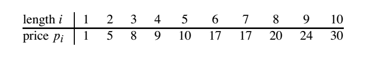

長さと値段の対応表が与えられるので、ある長さの棒の値段を最大化する分割の方法を考える

--

例）長さ4の棒の分割方法 全通り

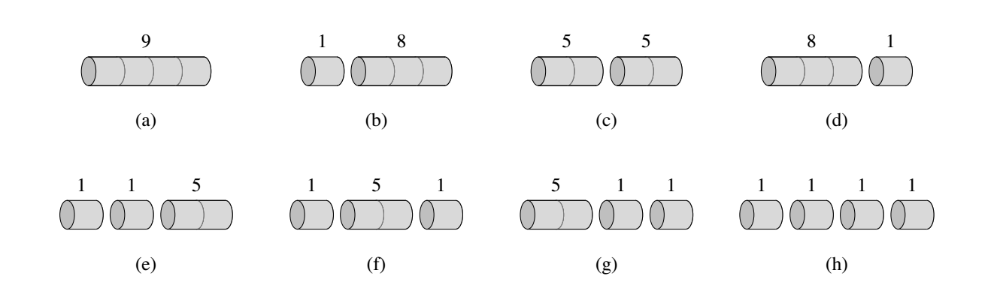

切れる可能性のある部分が $n-1$ 箇所なので、そこで切るか切らないかを考えて $2^{n-1}$

--

- $nondecreasing$ な並びの切り方をしたい場合、場合の数は partition function 、分割数となる。
- $e^{\pi \sqrt{2n/3}}/4n\sqrt3$ で近似できる。
- ただ、これでも多項式オーダーにはならない。

--

- 長さiの時の値段と切り方

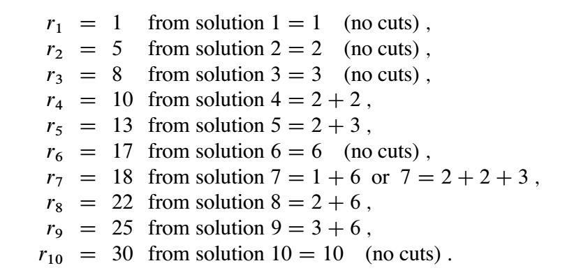

--

式にすると

![式]](./images/algo/rod04.png)
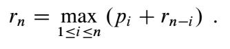

一つの部分問題に依存

---

##### Recursive top-down implementation 

素直に再帰的に式を実装すると

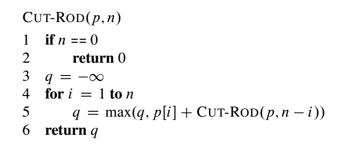

--

再帰呼び出しを木で表すと

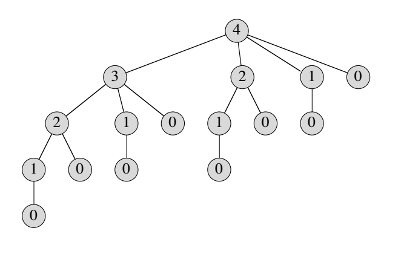

2が複数あるなど、重複があるのがわかる。

--

計算量は

$T(0)=1$ として

$$T(n)=1+\sum^{n-1}_{j=0}T(j)\ ...(15.3)$$

から

$T(n)=2^n$

- 指数関数オーダーになる。
- 演習問題のうち一つは、これを示しなさい、というもの。

---

##### Using dynamic programming for optimal rod cutting 

- 解き方が2つ紹介されている。
- 再帰的なトップダウンのアプローチ
- ボトムアップなアプローチ

--

- 再帰的なトップダウンのアプローチ


- まずは $-\infty$ で配列を初期化、キャプチャして再帰関数を呼ぶ
- $-\infty$ は不明を表している。

--

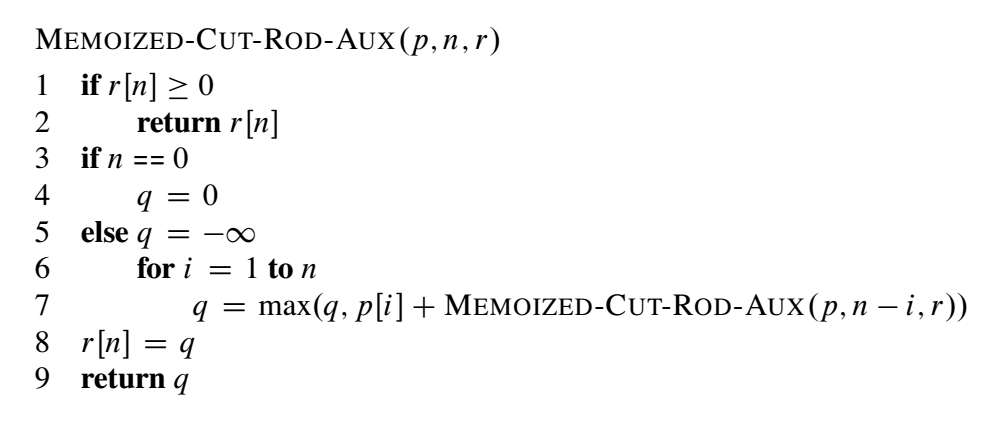

- 部分問題の値を記録する
- トップダウンに、nから降りていく。
- 値が $-\infty$ 、不明の時は再帰呼び出し。

--

- ボトムアップなアプローチ
- 長さ1の場合から表をボトムアップに埋めていく

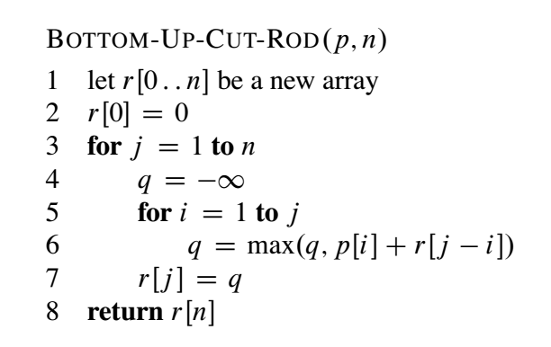

--

どちらも、長さn分最適値を考え、その度に平均 $n/2$ 候補を考えているため、計算量は $\Theta(n^2)$ となる。

---

##### Subproblem graphs

--

rod cutting の例だと以下

<div style="display: inline;">


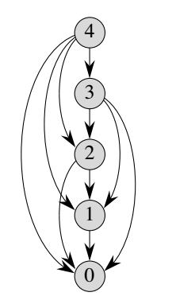

</div>

再帰呼び出しを木構造で表した図（左）をつぶしたもの。

--

- ボトムアップなアプローチは、トポロジカルソートの逆をたどっている
- 再帰的なトップダウンのDPは Subproblem graphs の深さ優先探索

と捉えられる。

--

- 頂点数が部分問題の数
- 辺の数が問題を解くために必要な時間

を表しているとして、計算量を考えられる。

---

##### Reconstructing a solution 

切り方も一緒に返したい場合どうするか？

--

- 以下のような、最後に切った長さを保持する配列sを用意する。

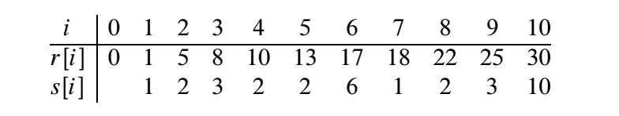

--

- 長さnからsの値を繰り返し引いていけば、切り方を構成できる。

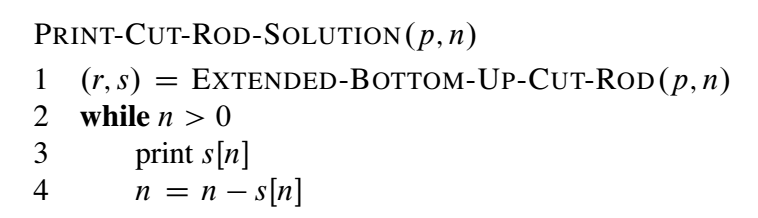

--

- sは以下のような拡張されたアルゴリズムで埋められる。

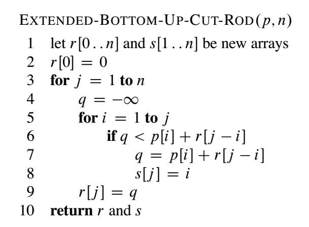

---

##### Exercises

--

###### 15.1-1 (15.3) と初期条件 $T(0)=1$ から (15.4) を導きなさい。

--

$T(0)=1$

$$T(n)=1+\sum^{n-1}_{j=0}T(j)\ ...(15.3)$$

から

$T(n)=2^n$

を導く。

--

差分を考えれば良い。

$T(n)-T(n-1)=T(n-1)$

$T(n)=2T(n-1)$

$\therefore T(n)=2^n$

---

###### 15.1-2 反例を挙げることで、長さ $i$ の棒の **’密度’** を $p_i/i$ として、密度の高い順に切れるだけ切っていくという貪欲法が間違っているということを示しなさい。

--

$n = 18$

|length|1|9|10|
|:--|:--:|:--:|
|price|1|81|100|
|density|1|9|10|

$10 \times 10 + 1 \times 1 \times 8 < 2 \times 81 \times 2$

---

###### 15.1-3 切断のたびにコスト $c$ がかかる場合の動的計画法のアルゴリズムを考えなさい。

--

切断しない場合以外は $c$ を引いた値で更新していけば良い。

---

###### 15.1-4 MEMOIZED-CUT-ROD アルゴリズムを、値だけでなく実際の解（切り方）も返すように変更しなさい。

--

s[0..n] を初期化し、rと同じタイミングで更新。qが更新されたタイミングでsを記録していけば良い。

---

###### 15.1-5 フィボナッチ数を動的計画法で解きなさい。 subproblem graph を書き、頂点と辺の数を求めなさい。

--

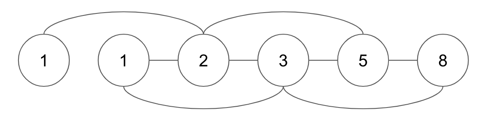

頂点 $n$ , 辺 $2(n-2)$

--

```
def fibonacci(n):
    F = [1,1]
    for i in range(1,n-1):
        F.append(F[i]+F[i-1])
    return F[-1]
```
