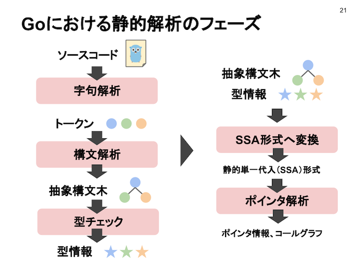
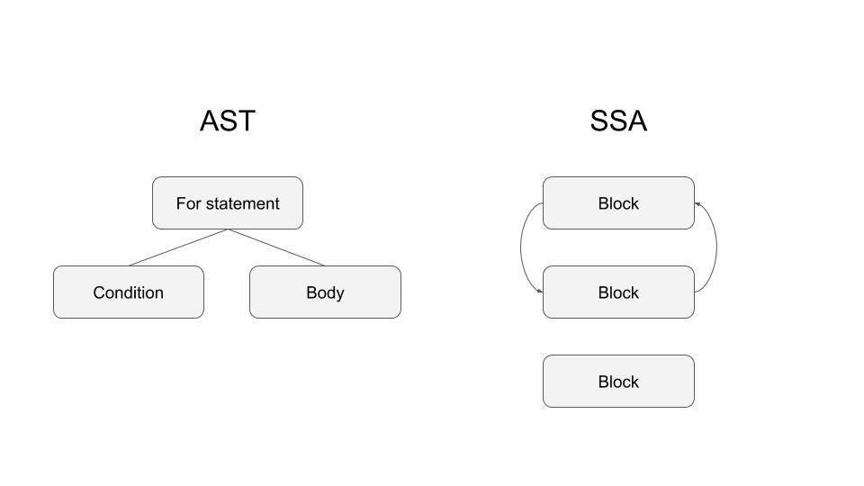
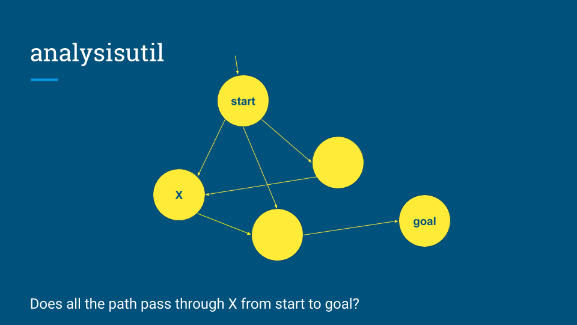

### nil safety in Go

---

### nil safety?

Kotlin

```kotlin
val user: User? = getUser()

val mail: String? = user.Email  // Compile Error

val mail: String? = user?.Email // OK
```

Go

```Go
var user *User

mail := user.Email     // Runtime Error

if user != nil {
    mail := user.Email // OK
}
```

---



@tenntenn さんの[『ソースコードを堪能せよ』](http://bit.ly/enjoysrc)より

---



---



---

### nilness

- 関数内部のブロックを走査し、値がnilであるか、nilでないか、unknowかを記録していく
- 同時にnilの値に対して危険な操作をしている箇所を検出していく
- SSA、ASTともに関数を一つの単位として走査する
  - そのため他の関数呼び出しは別の処理が必要であり、見逃されていた

---

### nilarg

- 全関数を走査して、nilになりうる型の引数に対して、nilチェックせずに危険な操作をしていないか確認
- 危険な操作を検知したら、該当の関数と引数を記録
- 関数内部で関数を呼んでおり、その呼び出しが危険な場合、再帰的に呼び出し元の関数も危険
  - そのため危険な関数リストを、リストの更新がなくなるまで無限ループで更新
- その後、実際に危険な関数をnilを引数として呼び出している箇所を検出

---

### Future Work

- LSPに組み込めば、関数がnilでpanicすることをプログラマが意識できるのでは？
- 無名関数の変数など、静的解析で分からない部分までは調べられない
- 引数が複数ある場合、偽陽性の可能性
- `go vet` 本体に入れてもらいたい...
- SSA生成周りにバグがありそうなのでデバッグ

---

### 引数が複数ある場合、偽陽性の可能性

```Go
func doOptional(do bool, f func()) {
    if do {
        f()
    }
}
```

---

### links

- @tenntenn さんの資料
  - http://bit.ly/enjoysrc
- つくったもの
  - https://github.com/Matts966/refsafe
  - https://github.com/Matts966/genelizer
  - nilarg
    - https://github.com/Matts966/nilarg
    - https://go-review.googlesource.com/c/tools/+/195377
