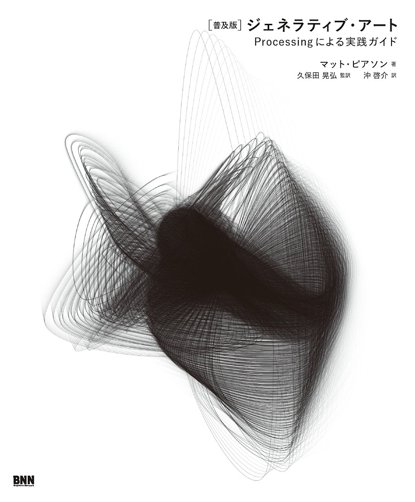

# Phics

#### Graphics Generation Service.

<small>Created by [Masahiro Matsui](https://tech-navy.tech)</small>
<div style='display:inline-block;'>
<p>Service</p>
<a rel='nofollow' href='https://phics.tech-navy.tech' style='cursor:default;'></a>
</div>
<div style='display:inline-block;'>
<p>Slide</p>
<a rel='nofollow' href='https://matts966.github.io/slides/slides-src/phics-export/' style='cursor:default'></a>
</div>

---

## 目次

1. [アプリケーション概要](#/2) 
2. [ジェネラティブアートとは](#/3)
3. [サーバー側実装](#/4)
4. [クライアント側実装](#/5)
5. [環境構築&Deploy自動化](#/6)
6. [反省点](#/7)
7. [今後の課題](#/8)
8. [参考文献](#/9)

---

## アプリケーション概要

- ユーザーはログイン後、裏返しのカードを配られる。

- タップすることで、カードを裏返すことができ、オモテ面にはジェネラティブアートが表示される。

- ボタンを押すことで、画像を保存することができる。

---

### ジェネラティブアートとは



---

## サーバー側実装

- Nginx
- Rails 5.2.1
- Ruby 2.3.7
- Webpacker
- devise
- react-rails

--

## サーバー側実装

- サブドメインでの運用（DNS,VPNのプロバイダでの設定 ＋ Nginxでのポートフォワーディング）。
- Webpacker でクライアント側のコンパイル。
- devise でユーザ認証。omniauth によるGoogle認証を実装（選択肢が多いと逆に迷って面倒という実体験と、管理の手軽さから一つに絞った）。
- react-rails で rails 側のデータを React クライアント側に渡す。

--

## Webpacker問題

- Webpackerがログを吐かずに落ちる問題
- その他の面倒ごと
- 最新版webpackへの対応の遅れ

---

## クライアント側実装

- React.js 16.7.0-alpha.0
- React P5Wrapper
- Material UI 3.7.1

--

### P5Wrapper でのReactっぽいデータハンドリング

```Javascript
p.setup = function () {
    p.myCustomRedrawAccordingToNewPropsHandler 
        = propsHandler(p, canvas);
}
```

---

## 環境構築&Deploy自動化

- capistrano
- unicorn
- webpack-dev-server
- foreman

--

## デプロイフロー

1. `rails s` , `webpacker-dev-server`, をbundleで実行（foremanでまとめておく）、実装の最終確認。
2. 問題なければ`cap production deploy`でデプロイを実行。
3. 内部で`assets:precompile`, `webpacker:compile`を行い、unicornサーバの再起動。

3のタイミング、場所が問題となった。

--

## Webpacker問題

- WebpackerはWebpackの設定ファイルなどを隠蔽してくれる。yml表記で比較的簡易に設定可能。
- その結果いろいろ包まないといけないため、Permissionエラーやbundleのversion管理の問題などで高頻度でこける。
- `--trace` をかけてもログがまともに吐かれないことがある。

--

## Webpacker問題 

### どうするか？

- ローカルではログも出るし、あまりこけないことに気づく。
- ユーザーがデフォルトで `root` だったり、もともとsystemが `ruby 2.3.0` を酷使してるサーバだったので、先述の様な問題が出たと考えられる。

    → ローカルでコンパイルを通してしまえばいい。
    → その後`rsync`でファイル転送を行う `capistarano` タスクを定義して使う。


---

## 反省点

- やりたいことに力点を置いた実装やライブラリの使用は効率よく進められたので、そういった方向に時間をもう少し使えればよかった。
- なんども行うデプロイは効率化しておこうと思った結果、そちらに時間を使い過ぎてしまった。
- 計画を全く立てずに作ったため、URLなどが雑。
- いろいろと間に合わず、認証の意味がないという残念な状態。

---

## 今後の課題

- チケットシステム（これを入れないとログインの意味なし）
- Email Confirmation
- リセマラ対策用のアカウントsoft-delete（コンテンツの価値と量を上げないと意味なし）
- GANモデルのアプリケーションへの取り込み(Ruby で書きたくないのでGAE/GOの予定)
- 実際のDBへの画像の保存（Saveボタンはカードを表に返してから出したい）

--

## 今後の課題

- ユーザーごとの所持画像一覧機能
- SNS share
- アイコン
- ~~PWA対応~~
- カードの種類増やす
- LP作る

---

## 参考文献

1. [普及版]ジェネラティブ・アート―Processingによる実践ガイド,　Matt Pearson (著), 久保田 晃弘 (監修), 沖 啓介 (翻訳), ビー・エヌ・エヌ新社, 2014/11

2. The Nature of Code (English Edition), Daniel Shiffman, Amazon Services International, Inc.

3. Processing Creative Coding and Generative Art in Processing 2, Greenberg, Ira, Xu, Dianna, Kumar, Deepak, Apress 2013